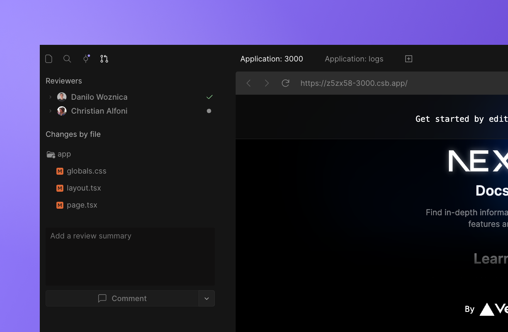
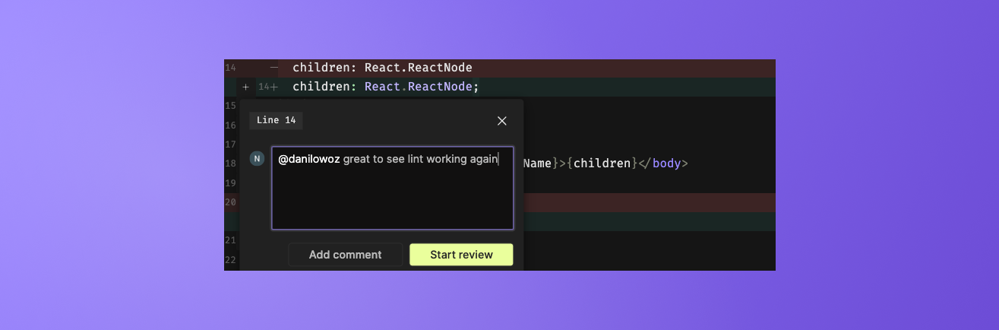
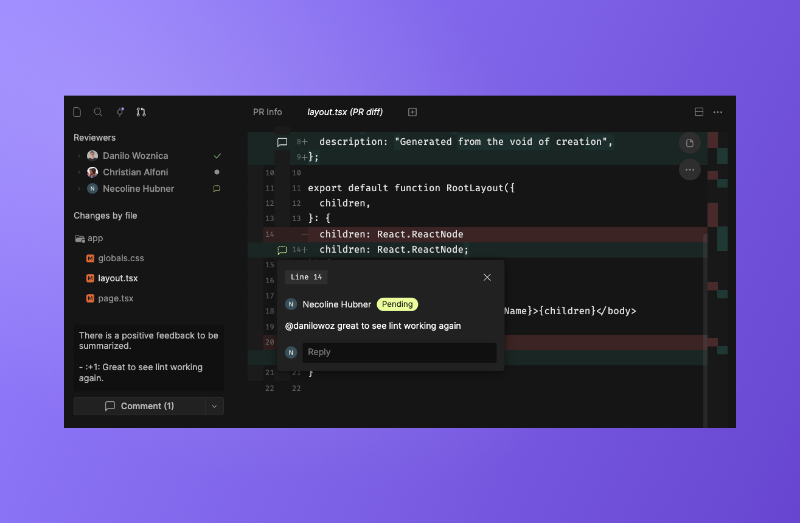
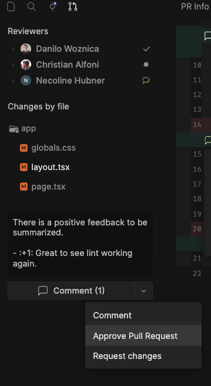
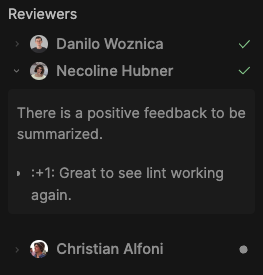

import { Callout } from 'nextra-theme-docs'

# Using CodeSandbox for code reviews

<Callout>
Code Reviews are currently only available for GitHub repositories.
</Callout>

CodeSandbox is the perfect place to conduct code reviews. By opening the branch from the GitHub PR in CodeSandbox, you will see the code changes, code preview and conversations all in one place. 

Reviews on CodeSandbox are synced with GitHub. It doesn't matter if you start a review in GitHub and finish it in CodeSandbox–all comments will be reflected in both GitHub and CodeSandbox.

## Getting started
Reviews require a repository admin to install the [CodeSandbox GitHub App](/learn/integrations/github-app). Once that is installed, you will see a comment in your GitHub PRs with links to open the branch and the preview.

## How it works
Once a PR is created, you will see links to the CodeSandbox branch. If you open the branch in the web editor, you will see something like this:

### Reviewers
All of the requested reviewers and their review status are listed at the top of the PR tab. If they have left a message with their review, you can view it by clicking the chevron to the left of their name.

### Changes by file
This section lists all the changes that were made to the code in the PR. 
At this time, comments are only shown on diff files.

### Comments
You can add a comment by opening a diff file and hovering your mouse by the diff line and selecting the `+` icon to the left of the line number, as highlighted below.

Open a comment by selecting the plus button and adding your comment.
You may choose to add a single comment which will be immediately synced with GitHub **or** start a review.

When working on a review, your comments will be shown as "Pending" as indicated by the following icon.

If you are a CodeSandbox Pro subscriber and have enabled [Boxy](/learn/boxy/overview), you may notice that the review message has an AI-generated message you can use if it suits you.

After submitting your review, you will see the updated status as a reviewer with your message (if you left one).

## Features and limitations

**PR Info**
The content of the PR's description is displayed on the `PR Info` tab. This tab is displayed by default when opening a PR from GitHub. You can open this tab at any time by clicking the PR title at the top of the page.

**Comment input options**

Currently, there are a few limitations to what you can input into comments in CodeSandbox. These are summarized below.

| Input | Can create | Can display|
| -------- | -------- | -------- |
| Text | ✅ | ✅ |
| Markdown | ✅ | ✅ |
| Mentions | ✅ | ✅ |
| Emojis | ❌ | ✅ |
| Images | with markdown | ✅ |

