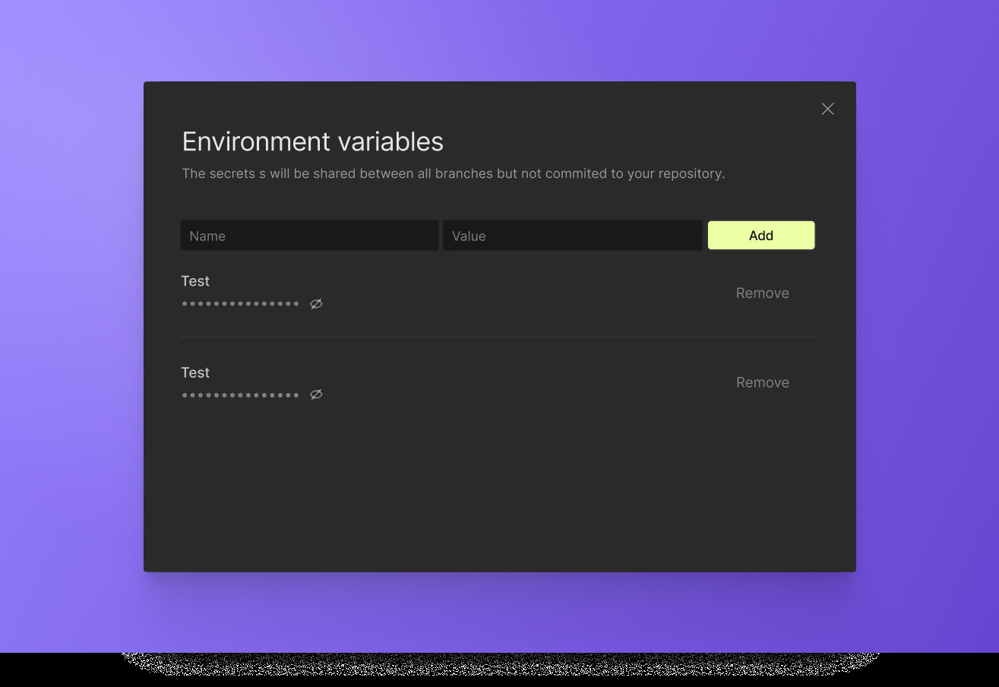
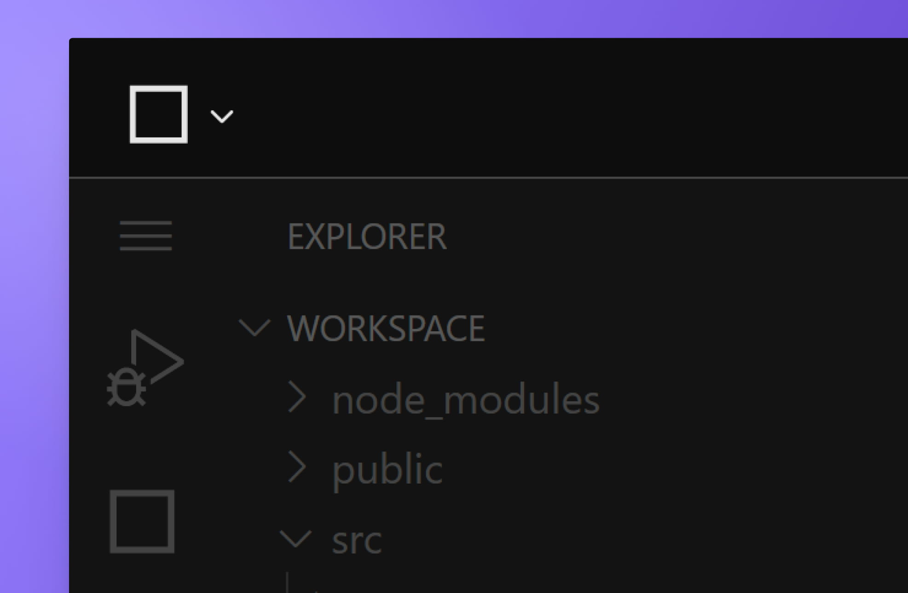
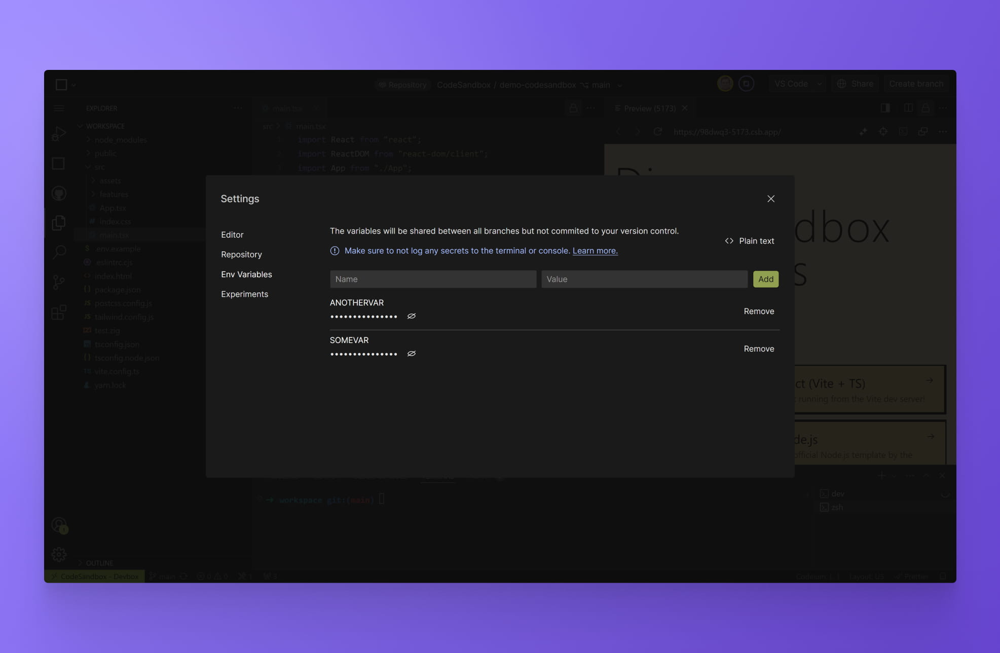
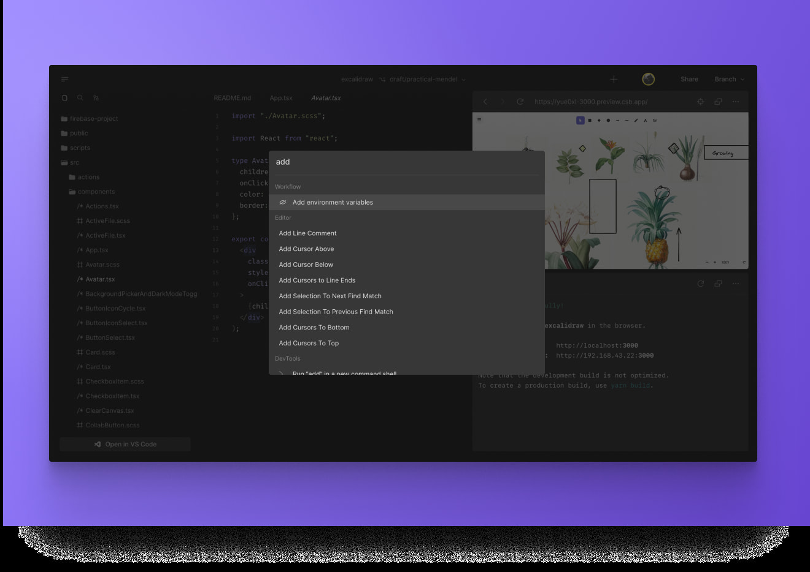
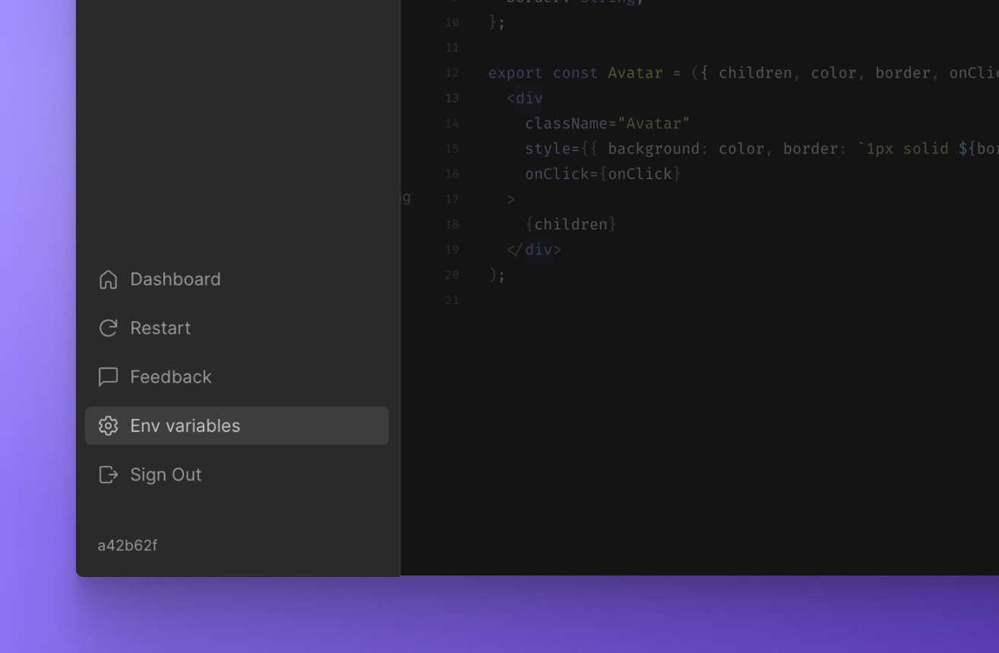

import { Callout } from 'nextra-theme-docs'
import Video from '../../../../../shared-components/Video'

# Environment variables and secrets

You can configure environment variables and secrets in your project, such as settings for your project or access tokens for APIs.

### Project-level environment variables and secrets

Currently, CodeSandbox Repositories only support **project-level** configuration. The secrets and environment variables are shared across all VMs, but you need to restart your workspace after making changes for them to take effect.

### Storage and Encryption

Environment variables are stored in our database, AES-encrypted. The encryption key is rerolled from time to time on an unannounced schedule and it is stored separately from the database.

### Privacy

Environment variables are enabled only for **private** repositories and they are only viewable by users with write access to the repository.

## Setting env variables and secrets
### From the UI

1. Open your project in the Web Editor.
2. Open the **Menu** through the icon in the top left corner.

3. Click on the **`Env variables`** item.
4. Add your configurations.

5. From the Editor's menu, press `Restart` to reload the workspace.

### From the command palette

1. From the Editor, open the command palette using <kbd>⌘</kbd> + <kbd>K</kbd>. 
2. Type `Add environment variables`.

3. Add and your configurations.
4. From the editor's menu, click to `Restart` the workspace.

### Manage environment variables and secrets

You can review and change the existing environment variables and secrets by acessing them at any time throught the `Environment variables` link in the Editor's menu. Don't forget to restart your workspace so that any changes take effect.

