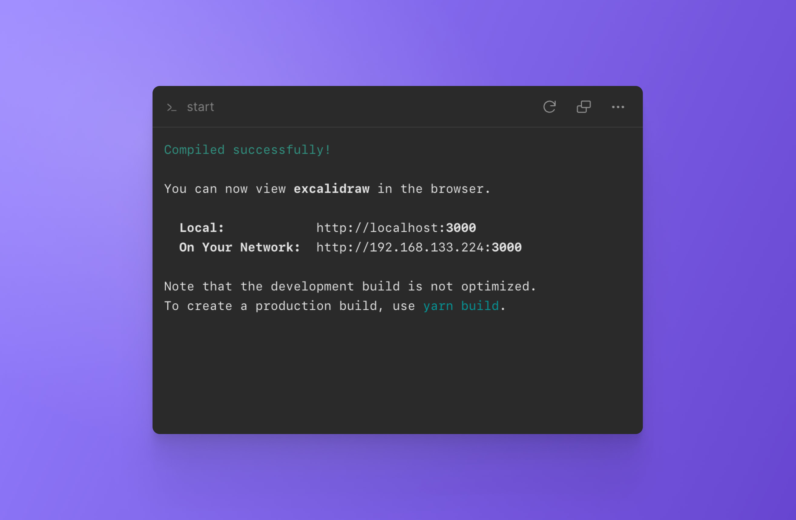

import { Callout } from 'nextra-theme-docs'

# Task



Tasks allow you to define commands (like `yarn start`) that you can run in a single click or on setup. These tasks are shared between all the clients connected to that branch.

## Adding a new task

To add a new task and make it available from the menu, go to the DevTools dropdown, select `Tasks` and click on `New Task`. This will open the command palette where you can type the desired command and press enter. 

<Callout emoji="⭑">
To make a task available on all branches, you need to commit and merge `tasks.json` to main.
</Callout>

<br/>
<br/>
# Configuring tasks

CodeSandbox Repositories can be configured through the `.codesandbox/tasks.json` configuration file in your repository. This file defines the steps to set up VMs and configures the running commands inside the workspace (webservers, Docker containers, tests, etc.).

<Callout emoji="⭑">
Checking these files into version control is recommended to ensure that every collaborator has a similar editing experience. This configuration can be tracked and additional changes can be made to specific branches. In addition, once the file is merged into your main branch, every new branch will follow the same configuration.
</Callout>

This is an example of a configuration:

```json
{
  "$schema": "https://codesandbox.io/schemas/tasks.json",
  "setupTasks": ["yarn install", "yarn build"],
  "tasks": {
    "install-dependencies": {
      "name": "Install Dependencies",
      "command": "yarn install"
    },
    "start-app": {
      "name": "Run Dev Server",
      "command": "yarn start",
      "runAtStart": true
    }
  }
}
```

## Default configuration

By default, CodeSandbox Repositories tries to infer scripts from the `package.json` file in your Repositories' root folder. In addition, you can always use the environment setup devtool to set any shell script to run your repositories.

## Setup tasks

Setup tasks are an array of commands that will run sequentially before the workspace is ready to start your application. If no value is provided, `installing dependencies` will be the default task (CodeSandbox will detect which package manager you use).

```json
{
  "$schema": "https://codesandbox.io/schemas/tasks.json",
  "setupTasks": [
    {
      "name": "Installing Dependencies",
      "command": "yarn install"
    },
    {
      "name": "Building Workspace",
      "command": "yarn build"
    }
  ]
}
```

## Tasks configuration

Tasks are scripts that can be run inside your repository. In many cases, these will call the scripts in your `package.json`, but they can also be used to run other executables.

```json
{
  "$schema": "https://codesandbox.io/schemas/tasks.json",
  "tasks": {
    // Task ID is used to uniquely identify each task, we use it to
    // keep track of the task even if the command changes
    "<task-id>": {
      "name": "Install Dependencies", // this is shown in the UI
      "command": "yarn", // the command to run in a shell
      "restartOn": {
        "files": ["yarn.lock", "**/package.json"], // File globs that trigger this task to restart
        "branch": true, // restart this task when creating a new branch/fork
      }
    },
    "<other-task-id>": {
      "name": "Build Repository",
      "command": "yarn build"
    },
    "dev-server": {
      "name": "Start Dev Server",
      "command": "yarn dev",
      // With the `preview` field set, the GitHub App will also add a link
      // to that preview to PRs, and it will become part of a GitHub
      // deployment:
      "preview": {
        "port": 4000,
        "prLink": "direct"
      }
    }
  }
}
```

The task ID does not appear on the UI, since each task has a display name configured alongside the command it runs.

### Configuring task ports

Tasks can have their ports assigned. Normally we try to automatically detect ports assigned to a task, but there are three advantages to defining them manually using the `preview` field:

1. We'll automatically eagerly a preview for this port when opening the sandbox.
2. If the port is not opened, and you try to open it using our preview, we give the option to open the task assigned to the port.
3. The [GitHub App](/learn/integrations/github-app) will automatically add the link to the preview in a comment for every pull request, and we'll create deployments for them.

The `preview` object has two fields: `port` and optional `prLink`. The `port` field defines the port that this task opens, and the `prLink` defines how PRs should link to this port. The possible options are `direct` and `devtool`.

With `direct`, you will directly open the preview URL from the PR.

With `devtool`, you will open the preview URL with an experimental devtool inside the preview.

Here's an example:

```json
{
  "$schema": "https://codesandbox.io/schemas/tasks.json",
  "tasks": {
    "dev-server": {
      "name": "Start Dev Server",
      "command": "yarn dev",
      // With the `preview` field set, the GitHub App will also add a link
      // to that preview to PRs, and it will become part of a GitHub
      // deployment:
      "preview": {
        "port": 4000,
        // This next field is optional:
        "prLink": "direct"
      }
    }
  }
}
```

## Examples

### Single page application

```json
{
  "$schema": "https://codesandbox.io/schemas/tasks.json",
  "tasks": {
    "run-dev": {
      "name": "App",
      "command": "yarn run dev",
      "runAtStart": true
    }
  }
}
```

### Mono-repo with multiple front-ends

```json
{
  "$schema": "https://codesandbox.io/schemas/tasks.json",
  "tasks":{
    "build":{
      "name":"Build Workspace",
      "command":"yarn build:workspace"
    },
    "homepage":{
      "name":"Homepage",
      "command":"yarn workspace homepage dev",
      "runAtStart":true
    },
    "docs":{
      "name":"Docs",
      "command":"yarn workspace docs dev"
    },
    "admin":{
      "name":"Admin",
      "command":"yarn workspace admin dev"
    },
    "dashboard":{
      "name":"Dashboard",
      "command":"yarn workspace dashboard dev"
    }
  }
}
```

## Reference

- [JSON Schema for `tasks.json`](https://codesandbox.io/schemas/tasks.json)
