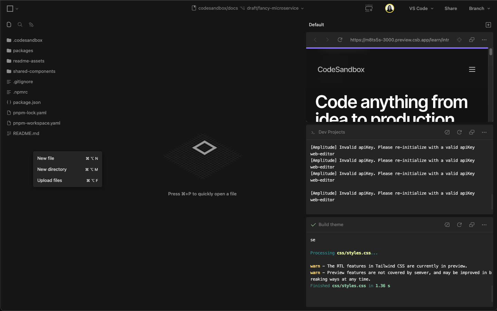

import Video from '../../../../../shared-components/Video'

# Upload static files

 
    <Video src="../../repositories-upload-dnd.mp4" />
 

You can upload static files to your repositories in CodeSandbox. To use this feature, drag the desired files from your computer and drop them into the file explorer on the sidebar. The files will then be automatically uploaded.

Alternatively, you can right-click in the file explorer or press `$mod+alt+F` to open the file input.

CodeSandbox allows you to upload several different file types (images, documents, videos, etc.) with up to 7MB each in our Free plans and 30MB each in our [Pro plans](https://codesandbox.io/pricing).