import { Tabs, WrapContent } from '../../../../../shared-components/Tabs'
import { Callout } from 'nextra-theme-docs'
import Video from '../../../../../shared-components/Video'

# Sandbox Editors

CodeSandbox offers two web editors and an iOS editor. A Sandbox is either a Browser Sandbox or a Cloud Sandbox (read more [here](/learn/sandboxes/overview)). All Sandboxes are available on the iOS app. 

CodeSandbox supports VS Code for [Cloud Sandboxes](/learn/sandboxes/overview?tab=cloud#what-is-a-cloud-sandbox) and [Repositories](/learn/repositories/overview).

<Tabs tabs={["Browser", "Cloud", "iOS"]}>
    <WrapContent>
## Synced Sandboxes
#### (previously called Repositories)

With CodeSandbox you can import any GitHub repository as a sandbox. An imported sandbox will
automatically stay in sync with the GitHub repository; if you make a commit to
GitHub it will reflect immediately in the sandbox.

For that reason we've made GitHub sandboxes immutable, this means that you
cannot make direct changes to the sandbox itself. They are treated as
[templates](/learn/sandboxes/templates), so you can fork from them. When you create a fork
of a GitHub sandbox we will still keep a reference to the original GitHub
repository. 

 
## Uploading Static Files

It's sometimes desired to have either images or big files in a sandbox. We allow
you to upload these within CodeSandbox. As a
[patron](https://codesandbox.io/patron) you are allowed to upload a maximum of
500MB, otherwise you are able to upload 20MB. Remember that all uploaded files
are public, regardless of the privacy of the sandbox

 
### Ways to upload
There are two ways to upload files: by using a wizard or by drag and dropping
the files in a folder in CodeSandbox. The wizard can be opened by clicking on
the upload icon in the Files tab.

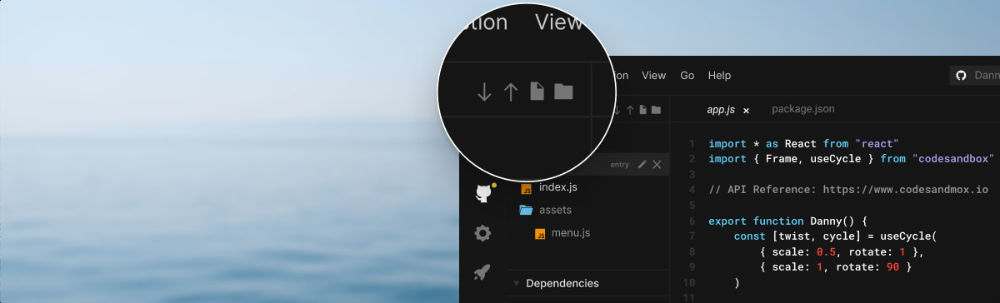

Dragging and dropping the files in the Files tab works as well.

 
### Storage Management

You can use an uploaded file in multiple sandboxes at the same time. For this
reason we have a separate 'Storage Management' that allows you to see which
files you have uploaded. You can find the manager in your user menu.

You are able to view your storage usage with the option to either open uploaded
files, add uploaded files to the opened sandbox or to delete an uploaded file.

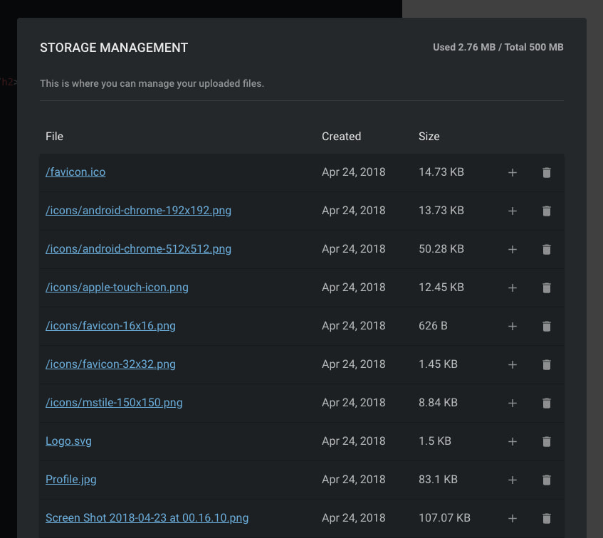

 
### CLI Integration

When you deploy a sandbox using the CLI we automatically detect the binary files
and upload them to the CodeSandbox Storage Management after getting
confirmation.
    </WrapContent>
    <WrapContent>
       The Cloud Sandbox Editor contains a set of features to increase the accessibility of complex tools like git, setup, review flows, contributions, and visualizing components. 

Here is an overview of the editor structure:

### Header

The header is where you perform general operations on your Sandbox.

**1. Navigation**
    - **Sandbox**: Click to return to the dashboard.

**2. Devtool menu**
    - **Add Devtools**: Set up devtools to facilitate your work and automatize repetitive tasks.

**3. Connections**
    - **Avatars**: See who's currently online and click to follow their steps.

**4. Collaborate**
    - **Share**: Invite friends to work together.

### Sidebar

The sidebar is a quick way to operate and navigate your codebase. It allows you to:

- View and manipulate your files
- Search inside your project
- Interact with source control

You can change the sidebar view using the icons at the top. 

<Callout emoji="⭑">
    You can drag and drop elements and shift or command click to select multiple items in the lists. 
</Callout>

### Code Editor

The code editor is where the magic happens ✨. We provide a base experience for all developers, with support for:

- Code formatting (Prettier or ESLint)
- LSP
- Intellisense
- Code completion
- Optimized syntax highlight
- Ligatures
- Multiple Editors
- Diff view

 If you want more advanced features, you can download our [VS Code extension](https://marketplace.visualstudio.com/items?itemName=CodeSandbox-io.codesandbox-projects) and [open the Cloud Sandbox in your local IDE](../introduction/overview?tab=vs-code#keep-working-on-vs-code) with your own customizations.

### DevTool

CodeSandbox signature layout with three columns and a runnable preview is back with superpowers. The new panel on the right supports useful tools to help you complete your work faster and more efficiently. Read more about it [here](/learn/repositories/devtools).

### Layout

<Video src="../../overview-resize.mp4" />

Cloud Sandbox Editor allows you to customize the three-panel layout to maximize the space for the task you are working on. Hover the mouse near the edge of each column to see the resize cursor; click and hold to change the layout. 

After reaching the proportional limit, keep dragging to hide the entire column. 

**Keyboard Shortcuts**

Press <kbd>Cmd/Ctrl</kbd> <kbd>B</kbd> to hide the Sidebar.

Press <kbd>Cmd/Ctrl</kbd> <kbd>.</kbd> to hide the DevTools. 
    </WrapContent>
     <WrapContent>
        ## Sandboxes on iOS

Sandboxes are the perfect kind of project for the times you have an idea you want to quickly prototype on the go. They are lightweight and can be shared easily.

Sandboxes on CodeSandbox for web are bundled inside your web browser using web technologies, whereas sandboxes running on the iOS app are run inside a Node.js 12 port. This can cause compatibility issues between iOS and web clients, but we are working hard to narrow this gap down.

 
## Getting Started

Upon launching the app you will first come across the Dashboard. This is the screen where all projects live and where you can create new ones.

 
### Local Sandboxes

In the “Local Sandboxes” section you can find those sandboxes whose files live locally on your device and that don’t require an internet connection for you to develop and execute them. 

You can either create new local sandboxes using any of the templates available or create an offline fork on a CodeSandbox sandbox.

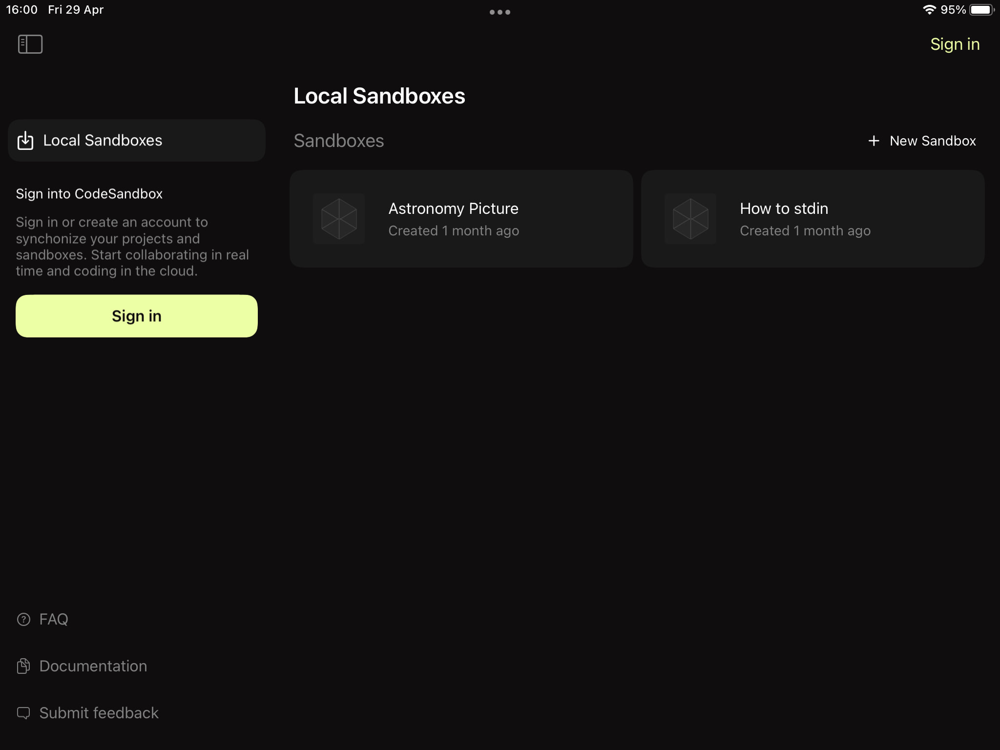

The first time you open the app you will see two sample projects for you to familiarize with the IDE.

Creating a Sandbox inside the “Local Sandboxes” section will create that prototyping project inside your devices and won’t be available online.
 
### CodeSandbox Sandboxes

If you complete the “Sign in” flow using your CodeSandbox account you will get automatic access to the CodeSandbox teams you belong to and their sandboxes.

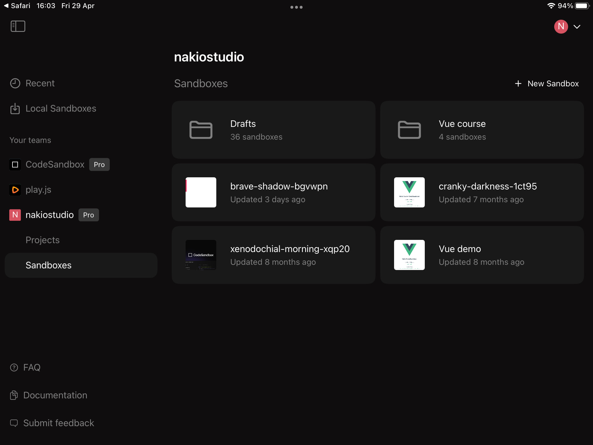

Creating a Sandbox inside the “Sandboxes” section of your team will create a Sandbox remotely on CodeSandbox inside the Collection you were browsing upon tapping on “New Sandbox”. These Sandboxes require internet connection and any changes you make to them will get automatically persisted on the cloud. In addition, any team member visiting that Sandbox will be able to participate on a live coding session.

 
### Creating a Sandbox

You can create a Sandbox from multiple sources and various types:

- Empty: these Sandboxes only contain a `package.json` files and a `index.js` file acting as the entry point of your program.
- Git repositories (Local Sandboxes only): you can clone a project from a Git repository, and to do it you’ll need to setup your credentials first under the “Git settings” section.
- Local templates: you can use one of the React.js, Vue.js or Next.js templates bundled in the app.
- CodeSandbox templates: you can use one of the compatible CodeSandbox templates available. It’s required to have a CodeSandbox account to access these.
- CodeSandbox Sandboxes: you can create a Local Sandbox from a CodeSandbox Sandbox by long tapping any Sandbox on the Dashboard and selecting the option “Import Sandbox”.

Creating a Local Sandbox

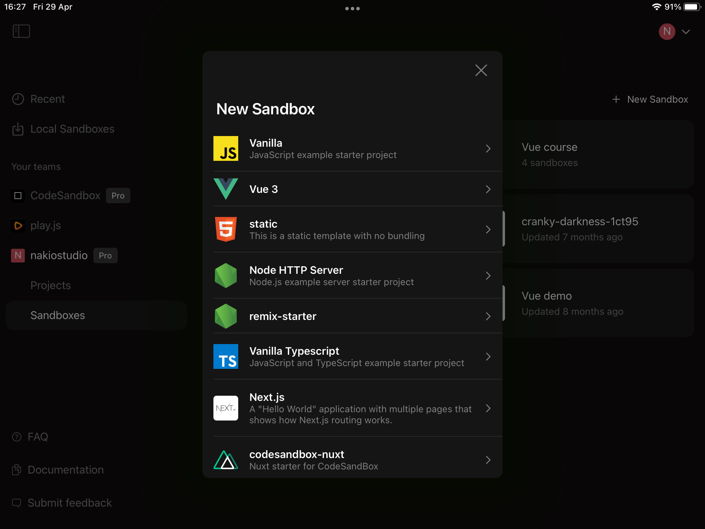

Creating a CodeSandbox Sandbox

 
## Development Environment

Once you have selected or created your Sandbox it is time to code and get your creativity flowing. In this section we will explain the different parts of the IDE and how they work.

 
### Sidebar

**Files Browser**
The place where you can manage the files and directories of your Sandbox. Long press any item on the list or click it with your mouse secondary button to see the actions available.

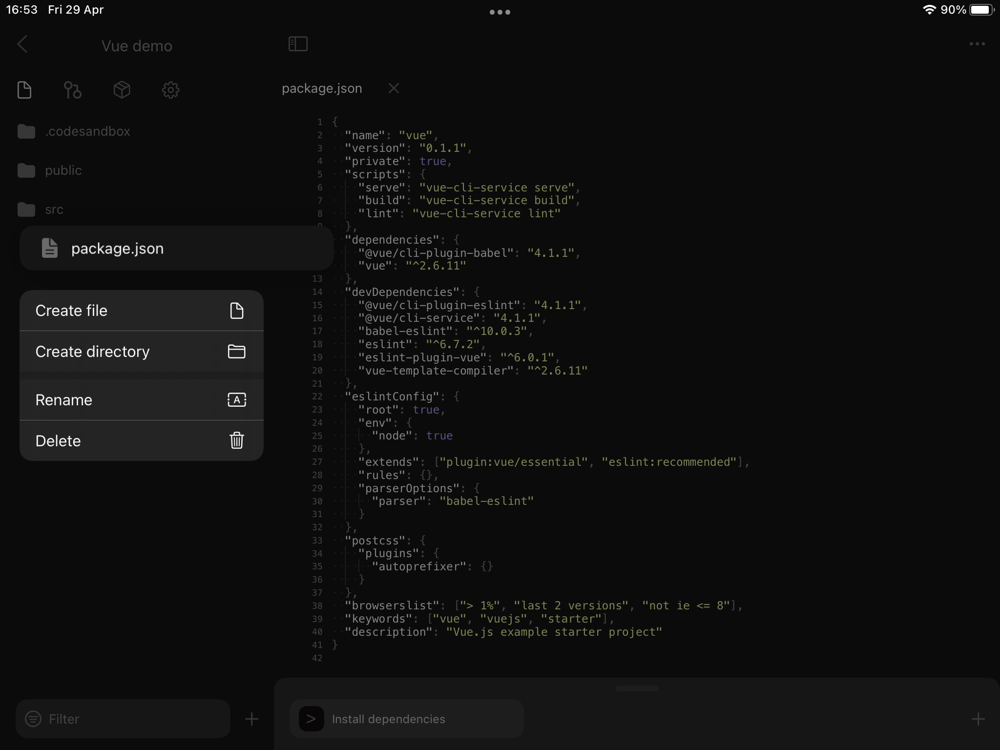

At the bottom of the Files Browser there is also a “Filter” field for you to quickly filter the files in the directories tree by a given term.

**Git Client**

Local Sandboxes include a Git Client that allows you to perform basic Git operations. You can either use it for version control or to keep your sandbox synchronized with a Git repository.

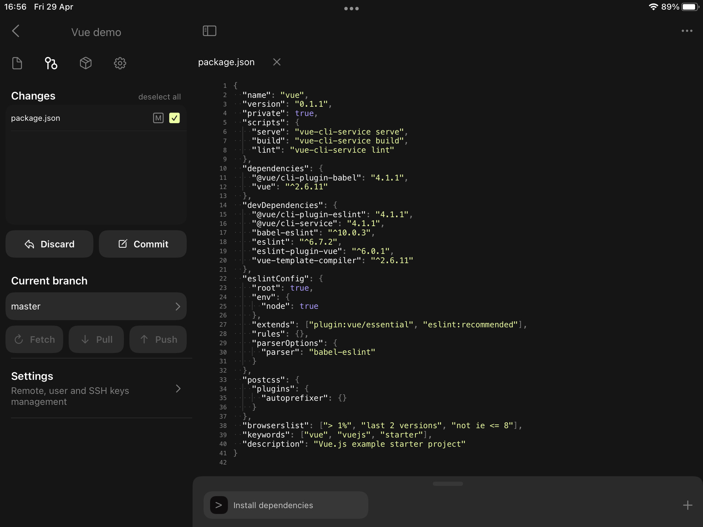

From this client you can:

- Commit changes.
- Discard changes.
- Push and pull changes from a remote branch.
- Manage the branches of your repository.
- Configure a remote Git repository.

**Manage dependencies**

Most Node.js applications need third party dependencies to work. The Dependencies screen parses your sandbox’ `package.json` file and offers a thin UI layer to manage your dependencies. This is: adding new dependencies, removing existing ones or triggering the dependencies installation process.

Remember that most of the sandboxes will require you to install the dependencies before running your app.

**Settings**

This is where you can tune the Editor experience and, in some cases, edit the metadata of your Sandbox.

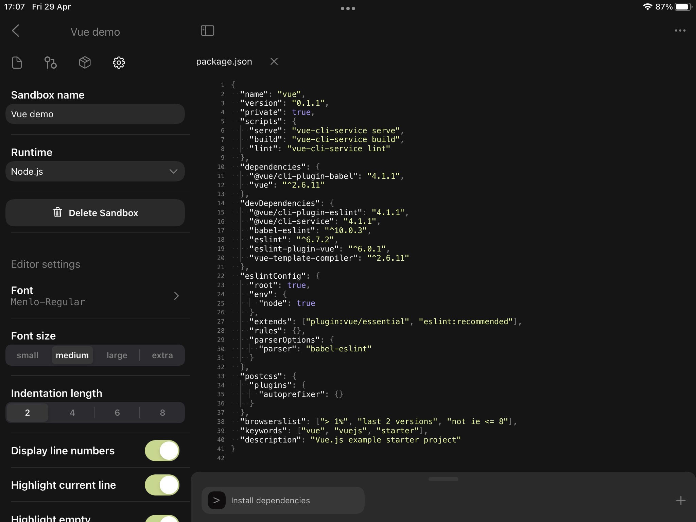
 

### Editor

The central place in the application and arguably where you will spend most of the time. The Editor offers various features to ease the development experience, offering syntax highlighting for 20 different language and IntelliSense for JavaScript source files.

At the top right of the screen you can see which users have joined the live coding session (only for CodeSandbox Sandboxes) and access to different actions by tapping on the ellipsis button.

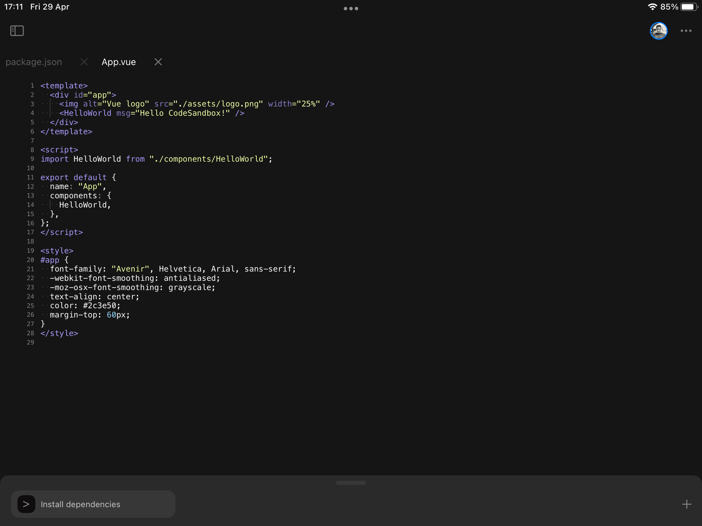

 

### Runtime

At the bottom of the Editor you will find everything you need to execute the scripts defined in your `package.json` file. By clicking on the “+” icon the list of the scripts available will show up. 

In case there is no scripts defined in your `package.json` file, the application will show a default `node index.js` action that will try to run an `index.js` file located at the root of your sandbox.

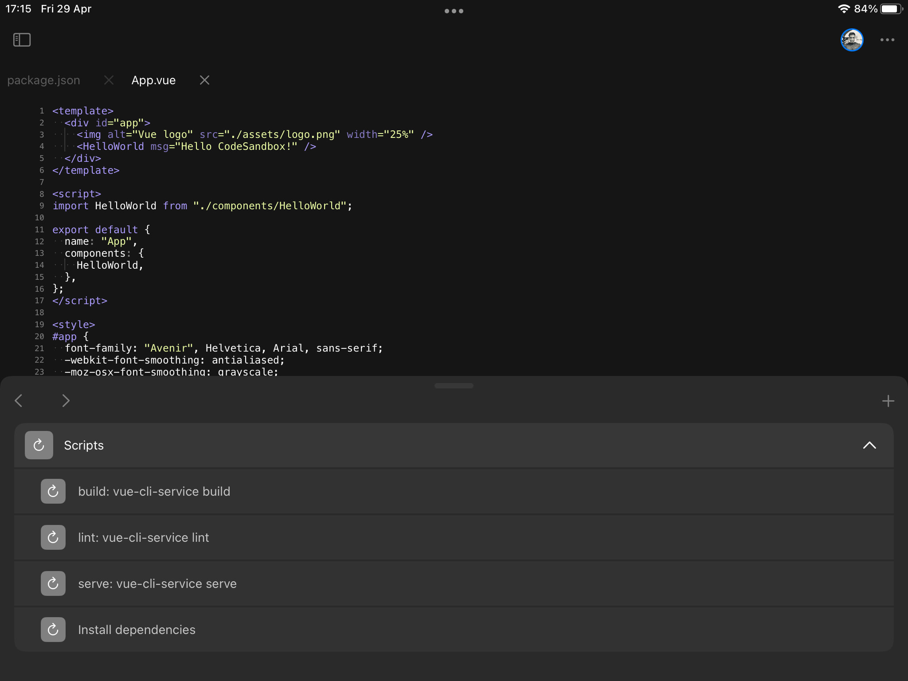

Tapping on any of these scripts will get a Node.js program running and an interactive console for it will be shown.

At the left of the interactive console there is a play/stop button that allows you to control the execution state of the program, whereas at the right you have a button to open the web preview for the port reserved for this console (available via `process.env['PORT']`), a button to clear the output of the program and another button to close the console. Closing a console won’t stop the program so you can reopen a console running in the background by tapping on it inside the “Scripts” list visible upon tapping on the “+” button.

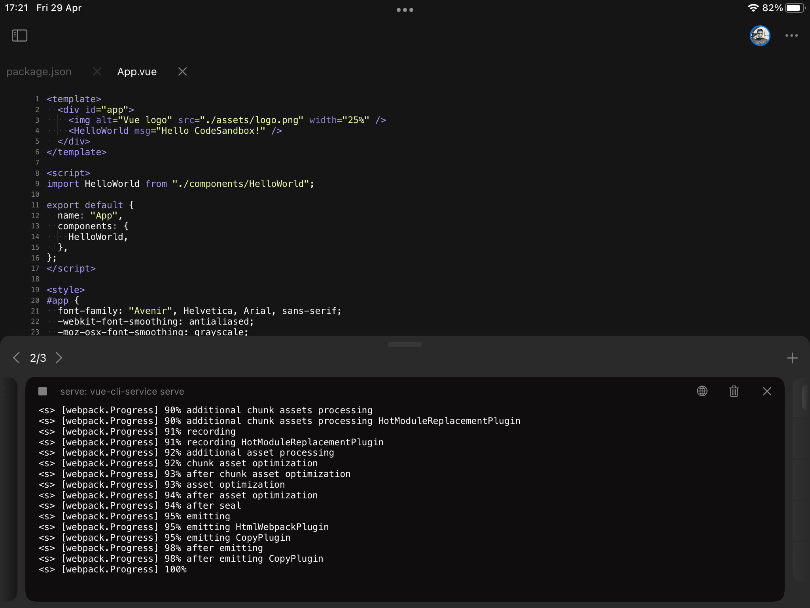
 

### Web Browser

You can preview any web app being developed in the IDE using the in-app web browser. It provides various debugging tools and facilitates opening a preview using the right [localhost](http://localhost) port.

You can open it at any time by tapping on the “globe” icon at top-right corner of every running script console.

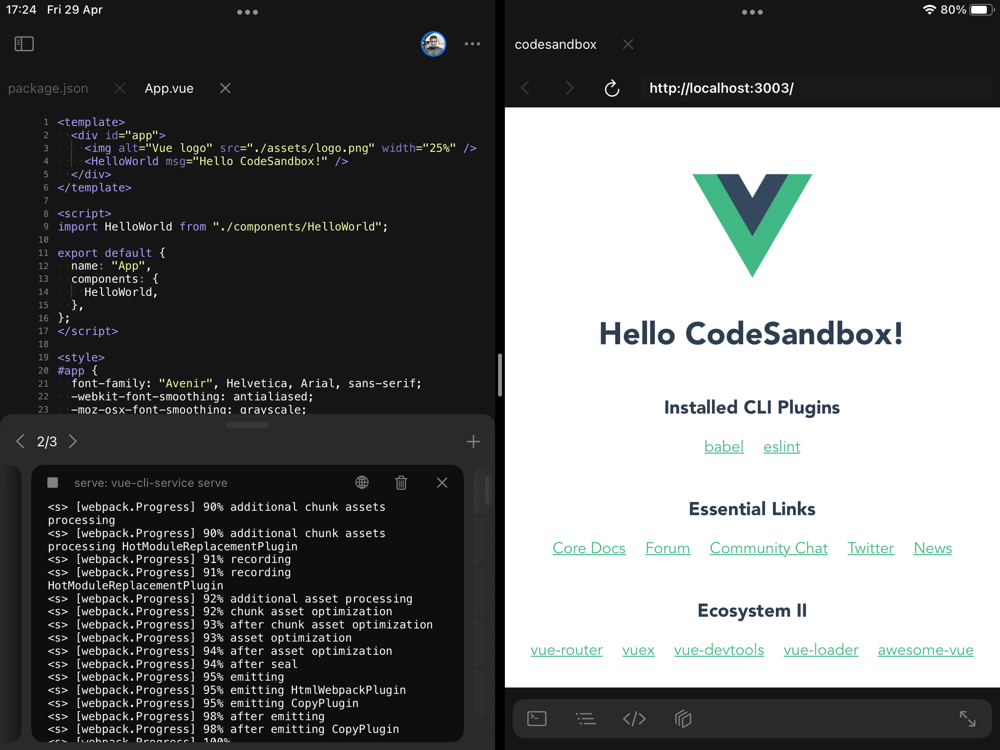

The in-app web browser offers a console, a node browser, a source code viewer and a layer inspector to help you debug your web apps.

**Console**

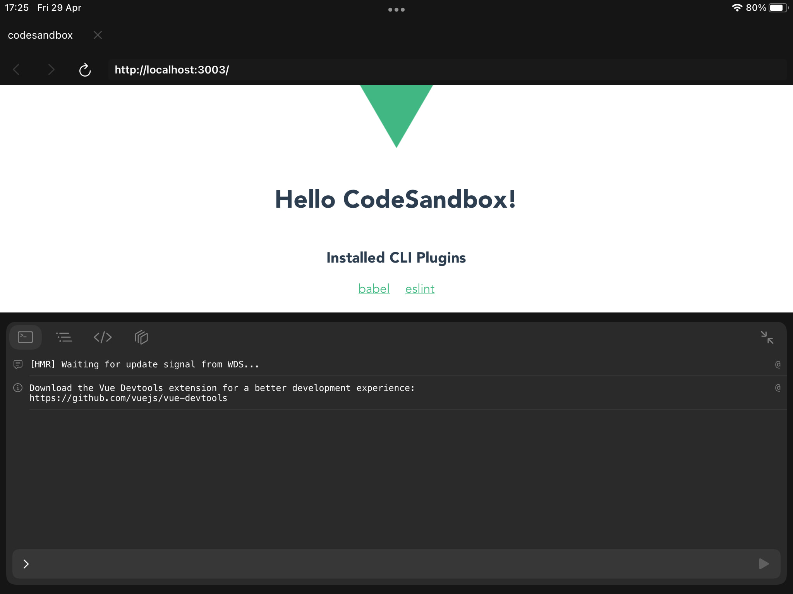

**Nodes browser (long tap any node to see options)**

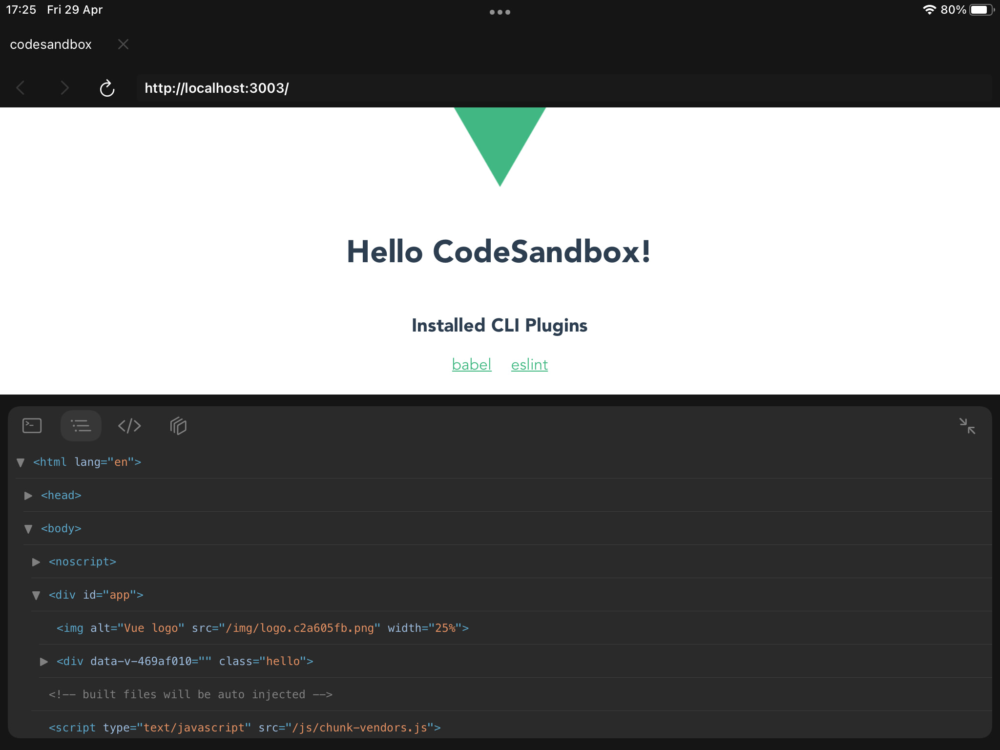

**Source code viewer**

**3D layers inspector**

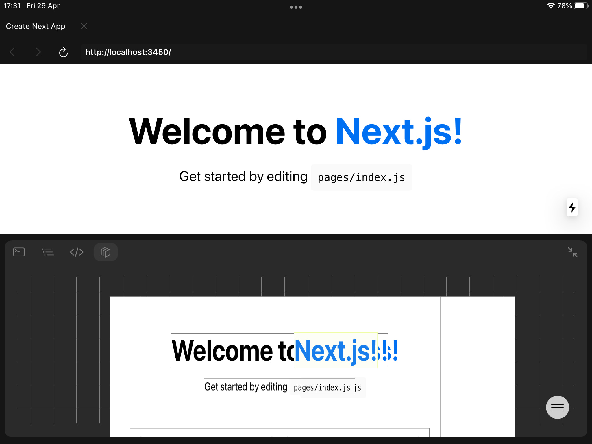
    </WrapContent>
</Tabs>