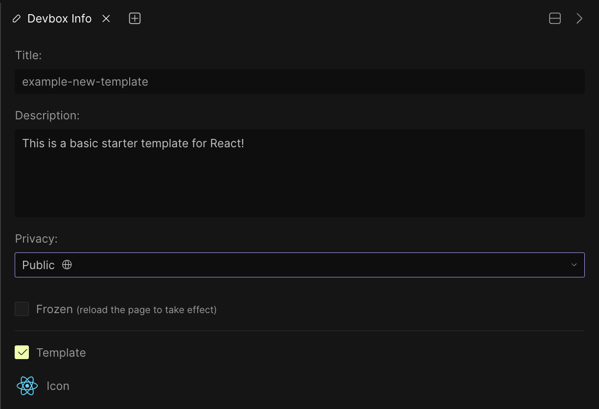
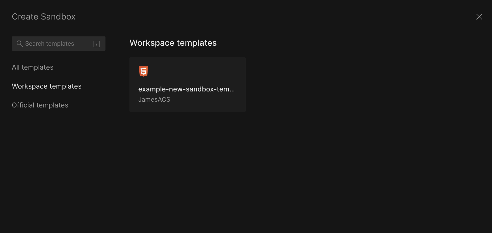
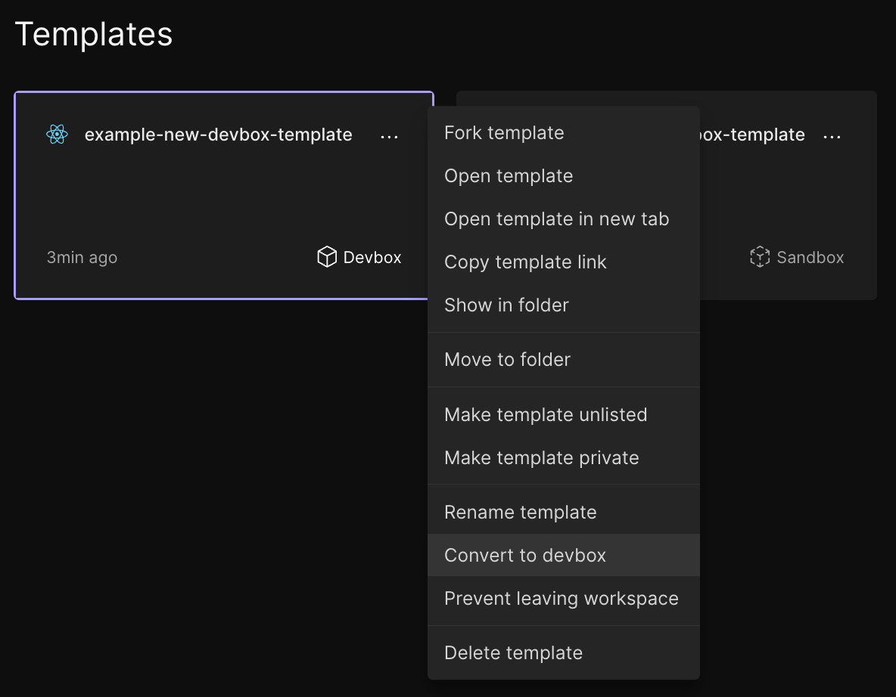

import { Callout } from 'nextra-theme-docs'

---

# Templates

## What are Templates?

Templates are starting points for development environments that you create through CodeSandbox. When you pick a template, you create a fork of the original project. Forked templates are already set up with the
configuration, file structure and installed dependencies. So you don't have to
spend time doing this each time you begin working on something new. They
are easily accessible from the ["Create" modal](https://codesandbox.io/s).

From the modal, CodeSandbox offers several official templates for several different programming languages.

You can also create your own custom templates from your projects. So you can fully customize your development start points for your particular use case and preferences. Once a custom
template has been created, you can use it to start new projects through the ["Create" modal](https://codesandbox.io/s). Custom templates can also be added to workspaces so members can use them. Any custom templates you can access can be found in the [Templates folder](https://codesandbox.io/dashboard/templates) or under 'Workspace Templates' within the modal.

## How to make a custom template

There are a few ways to create a template, but the main way is from within the
"Sandbox Info" panel inside the editor. When viewing one of your Sandboxes,
expand the "Sandbox Info" panel on the left. You will then see an edit icon in line with the "Sandbox Info" header. Just click the icon and then check the 'Template' box in the settings pane that opens on the right of the editor.

<Callout>
You can also rename and set a description for the template from this interface, as well as configure the template privacy options. Private and Unlisted Templates are only available for Pro subscribers.
</Callout>

You can also create templates from the Dashboard. You can do this by either dragging and dropping a Sandbox from
any folder into ["Templates"](https://codesandbox.io/dashboard/templates) or using the right-click menu and selecting
_Make Sandbox a Template_.

<Callout>
The Templates folder will only appear once you have created your first custom template. 
</Callout>

## Using Templates

After you've made your first custom template, there are a few places from which
you can access and use them. First, inside the "Create a Sandbox" modal,
you will see a list of your templates under `Workspace Templates`. Clicking on one of
these will fork the template and open it in the editor.

You can also find all of your templates under the [Templates folder](https://codesandbox.io/dashboard/templates) on the
Dashboard. Clicking on any of the templates in this folder will open
it in the editor.

## Editing Templates

When you first create a template it will be fully editable to allow you to quickly make any required changes.
Once you're happy with the template, just open up the 'Template Info' settings using the instructions above. 
Then, check 'Frozen' and reload the page to prevent further changes. 
In order to make further changes to a template, you just need to uncheck 'Frozen' and reload the page again.  
Any time you try to save a change to a frozen template, it will automatically fork into a new environment. 

<Callout>
The 'Template Info' panel is in the same position as the 'Sandbox Info' panel prior to conversion.
</Callout>

## Deleting Templates

There are a few ways in which you can "delete" a template. From the "Template
Info" panel inside the editor, you can uncheck 'Template'. Doing this will convert the template back
to a regular Sandbox and remove it from the ["Create" modal](https://codesandbox.io/s).

You can then delete the Sandbox from your Dashboard as you would normally. 

Alternatively, you can use the 'right click' template's options menu inside the [Templates folder](https://codesandbox.io/dashboard/templates)
folder to select _Convert to Sandbox_.

<Callout>
This menu is only available within the Templates folder.
</Callout>
