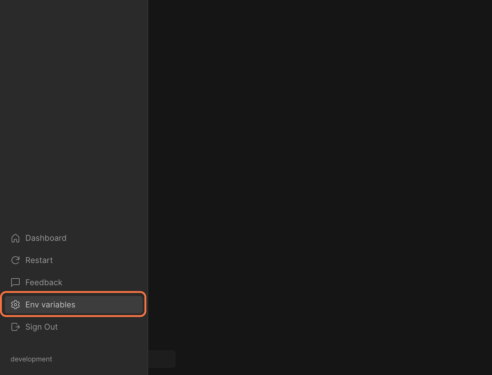

import Callout from 'nextra-theme-docs/callout'
import Video from '../../../../../shared-components/Video'

# Environment variables and secrets

Configure environment variables and secrets in your project, such as settings for your project or access tokens for APIs.

<Video src="../assets/EnvVars.mp4" />

### Project-level environment variables and secrets

Currently CodeSandbox Projects only supports **project-level** configuration. The secrets and environment variables are shared across all VMs, but it's necessary to restart your workspace after making changes for them to take effect.

### Storage and Encription

Environment variables are stored in our database, AES encrypted. The encryption key is rerolled from time to time on an unannounced schedule and the key is stored separately from the database.

### Privacy

Environment variables are enabled only for **private** repositories and they are only viewable by users with **write access** to the repository.

## Setting env variables and secrets
### From the UI

1. Open your project in the Editor.
2. Open the **Menu** through the icon in the top left corner.
2. Click on the `Env variables` item.
1. Add and save your configurations.
1. From the Editor's menu, press `Restart` to reload the workspace.

### From the command palette

1. From the Editor, open the command palette using <kbd>⌘</kbd> + <kbd>K</kbd>. 
2. Type `Add environment variables`.
1. Add and save your configurations.
1. From the editor's menu, click to `Restart` the workspace.

### Manage environment variables and secrets

You can review and change all the existing environment variables and secrets by acessing them at any time throught the `Environment variables` link in the menu.

