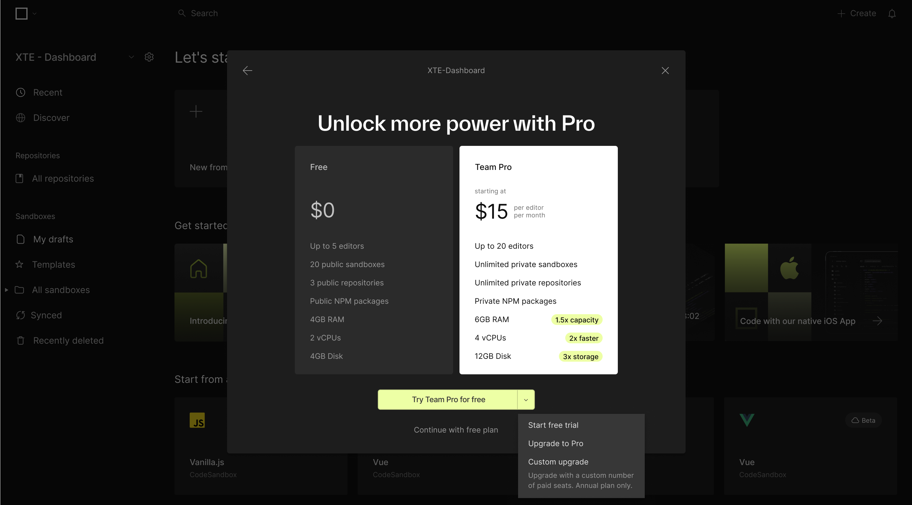
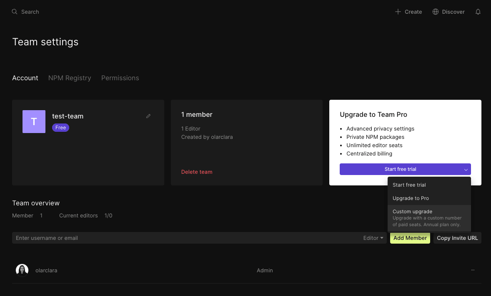
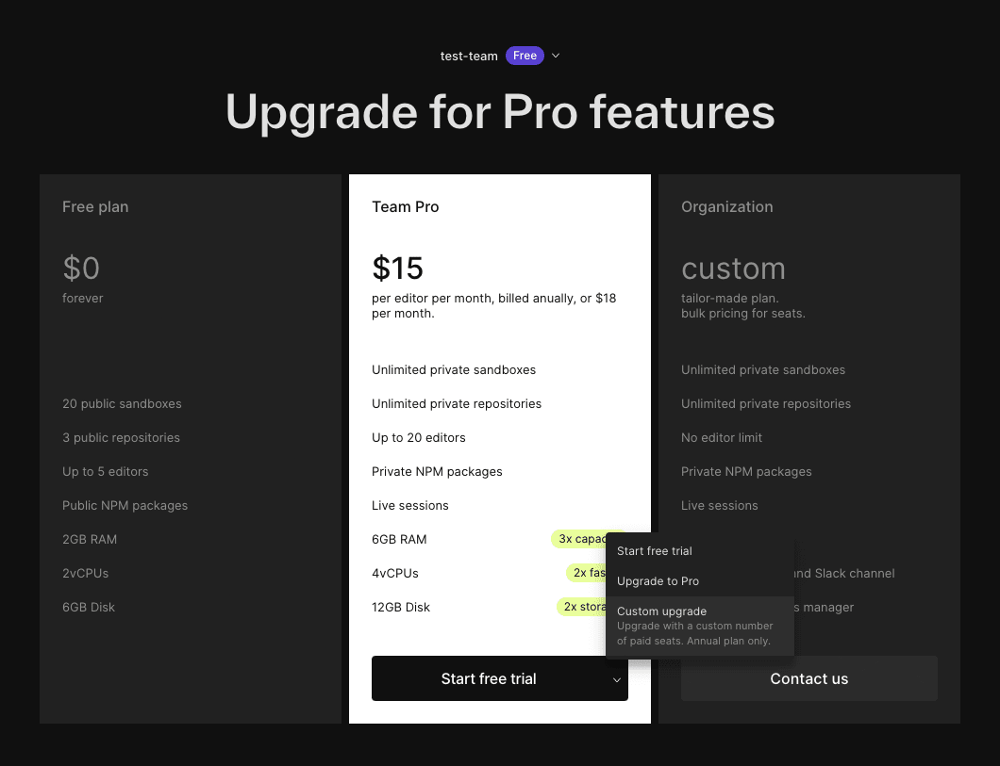

import { Callout } from 'nextra-theme-docs'

# Pricing FAQs

## Can I purchase more than one seat at a time?
Yes, bulk purchasing of seats is possible on annual subscriptions. 
If you are creating a team for the first time, select `Custom upgrade` from the button dropdown. 

This will take you to a checkout page where you can set the number of team members you would like to allot to the team.

If you have already created a team, you can find the same option available on the [team settings](/learn/introduction/workspace#managing-teams-and-subscriptions) page.

And you can also find this option on the [Pro page](https://codesandbox.io/pro?team) as shown below.

## Can I try a Pro Subscription before I commit?
Yes. Trials are available for Team Pro. You can learn more on our [Trials page](/learn/plan-billing/trials).

## Can I switch my billing to annual or monthly after I subscribe?
When you sign up for a subscription, you can choose between monthly and annual billing. If you select one and are unhappy with your choice, you will have the option to change it at the start of the next billing cycle. Please contact [support](mailto:support@codesandbox.io) to make this request.

## Can I sign up for a trial without adding my credit card information?
Yes, trials do not require a credit card to sign up. If you wish to continue with the Pro experience after the trial expires, you will need to add payment details.

## Why can't I see my subscription information on my team settings page?
Only team admins have access to subscription details and the option to manage a subscription. Non-admins (team members with editor and viewer roles) will not see the same options on the team settings page.