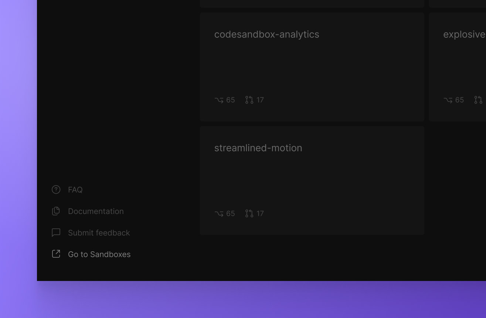

import Callout from 'nextra-theme-docs/callout'

# Teams

In CodeSandbox Projects, you can organize your work under Personal Projects or Teams. Your teams are synced across Sandboxes and Projects and every team member can navigate between the imported projects. 

For the open beta release, Projects is granting visibility of all projects to all team members by replicating the existing privacy settings already in place on GitHub. 

## Managing your teams

Team management is currently handled exclusively through the [Sandboxes dashboard](https://codesandbox.io/dashboard). To access it from Projects, click on the `Go to Sandboxes` link at the bottom left corner of the dashboard.

### Creating a new team

1. Go to the [Sandboxes Dashboard](https://codesandbox.io/dashboard).
1. Open the team dropdown or click on the `Create a new team` button in the bottom left corner.
1. Choose a **team name**.
1. Add **team members** by inviting them via email or searching for their CodeSandbox username.

### Add or remove people from a team

1. Go to the [Sandboxes Dashboard](https://codesandbox.io/dashboard).
1. In the top left corner, select the **team** you'd like to edit in the dropdown. 
1. Click on the **settings** icon next to the team.
1. Add or remove people through the **Members** section by inviting them via email or searching for their CodeSandbox username.

