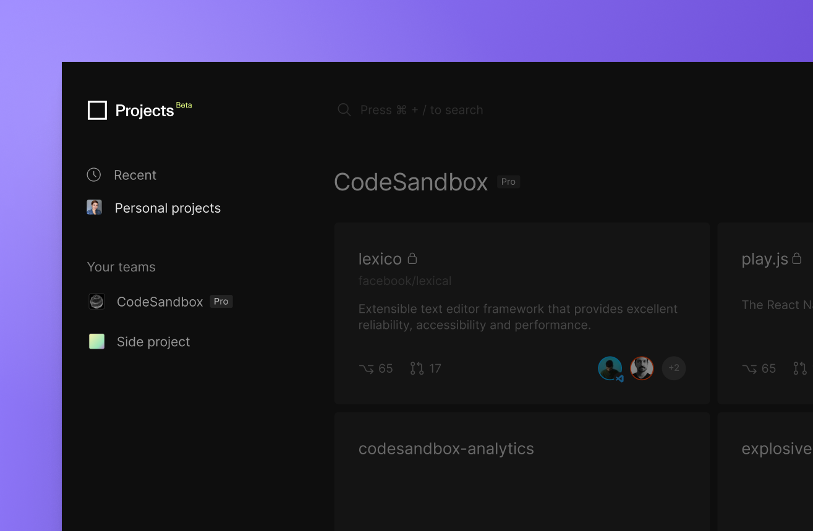
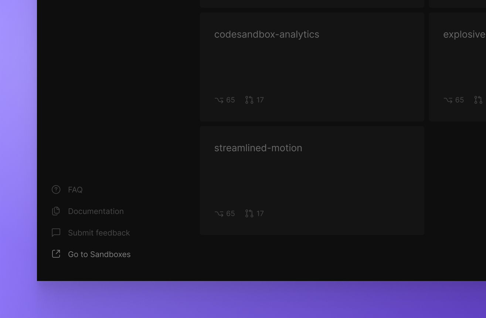

import Callout from 'nextra-theme-docs/callout'

# Team and access management

You can organize your work under `Personal Projects` and `Teams` inside CodeSandbox Projects. Your teams are synced across Sandboxes and Projects and every team member can navigate between the imported projects. 

For the open beta release, Projects is granting visibility of all projects to teams replicating the existing privacy settings already in place on GitHub.

## Managing your team

Managing your team is possible through the Sandboxes dashboard. 

On the sandboxes dashboard you can change to any of your teams and with clicking the gear icon you can manage your existing team. 

### Add or remove people from your team

1. Go to the [Sandboxes Dashboard](https://codesandbox.io/dashboard).
1. In the top left corner, select the team you'd like to edit in the dropdown. 
1. Click on the settings icon next to the team.
1. Add or remove people through the **Members** section by inviting them via email or searching for their CodeSandbox username.

### Creating a new team

1. Go to the [Sandboxes Dashboard](https://codesandbox.io/dashboard).
1. Open the team dropdown or click in the `Create a new team` button in the bottom left corner.
1. Choose a **team name**.
1. Add team members by inviting them via email or searching for their CodeSandbox username.

