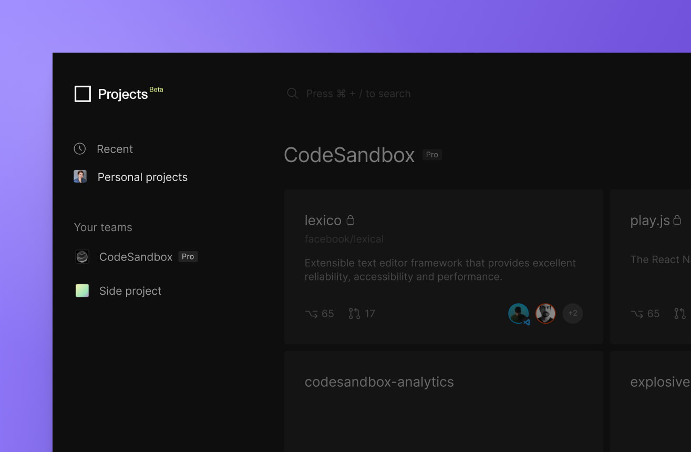
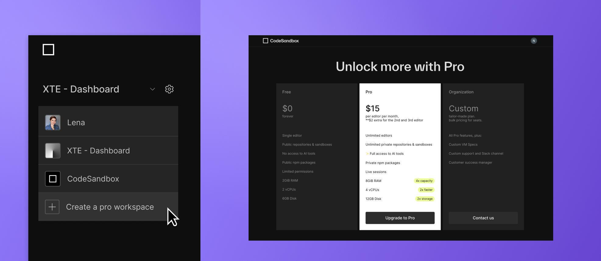

import { Callout } from 'nextra-theme-docs'

# Teams

In CodeSandbox Repositories, you can organize your work under Personal Repositories or Teams. Your teams are synced across Sandboxes and Repositories and every team member can navigate between the imported repositories. 

For repositories is granting visibility of all repositories to all team members by replicating the existing privacy settings already in place on GitHub. 

### Creating a new team

1. Go to the [Dashboard](https://codesandbox.io/dashboard).
1. Open the team dropdown or click on the `Create a new team` button in the bottom left corner.
1. Choose a **team name**.
1. Add **team members** by inviting them via email or searching for their CodeSandbox username.

### Add or remove people from a team

1. Go to the [Dashboard](https://codesandbox.io/dashboard).
1. In the top left corner, select the **team** you'd like to edit in the dropdown. 
1. Click on the **settings** icon next to the team.
1. Add or remove people through the **Members** section by inviting them via email or searching for their CodeSandbox username.
