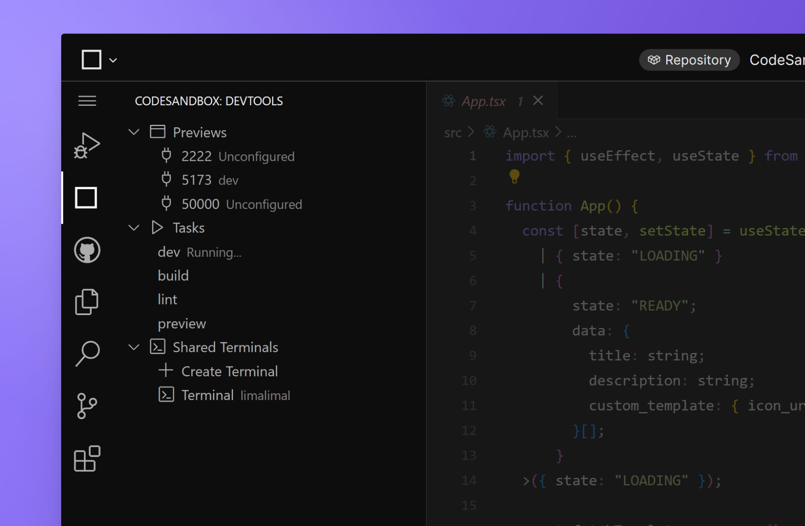

import { Callout } from 'nextra-theme-docs'

# DevTools

The CodeSandbox DevTools panel aggregates a series of tools that allow you to work faster and more efficiently. Among these tools, you will find Previews, Tasks and Shared Terminals.
 

## Previews
Any [previews](./preview) associated with your project, namely those spun up by tasks, will be accessible in a port listed under `Previews` in the DevTools tab. Each preview will show a tag next to it to identify its associated task, or show `Unconfigured` if no task is tied to it.

Clicking on a listed preview will open it on the right side of the editor.

<Callout emoji="💡">
You can also see the list of ports in the terminal panel under the `Ports` tab at the bottom of the editor.
</Callout>

## Tasks

[Tasks](./task) set in the `tasks.json` file will be listed in the DevTools tab. This lists all the configured tasks and allow you to run, stop or restart them. Any tasks that are running will display a `Running...` tag next to them.

## Shared Terminals
Any active shared terminals will be listed under `Shared Terminals` in the DevTools tab. These are a specific type of [terminal](./terminal) that is managed by Pitcher, which means that other users with access to the project can see them.

From this tab, you can also create new shared terminals, which will open in the Terminal tab at the bottom of the editor.