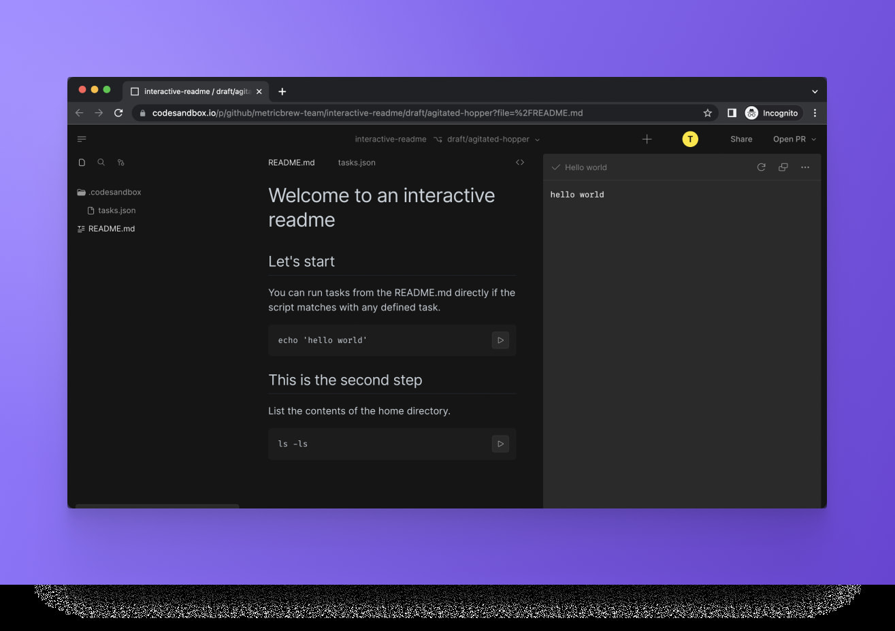
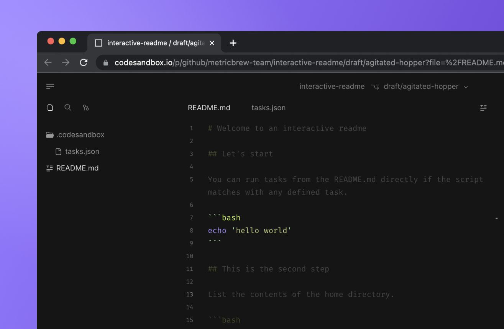
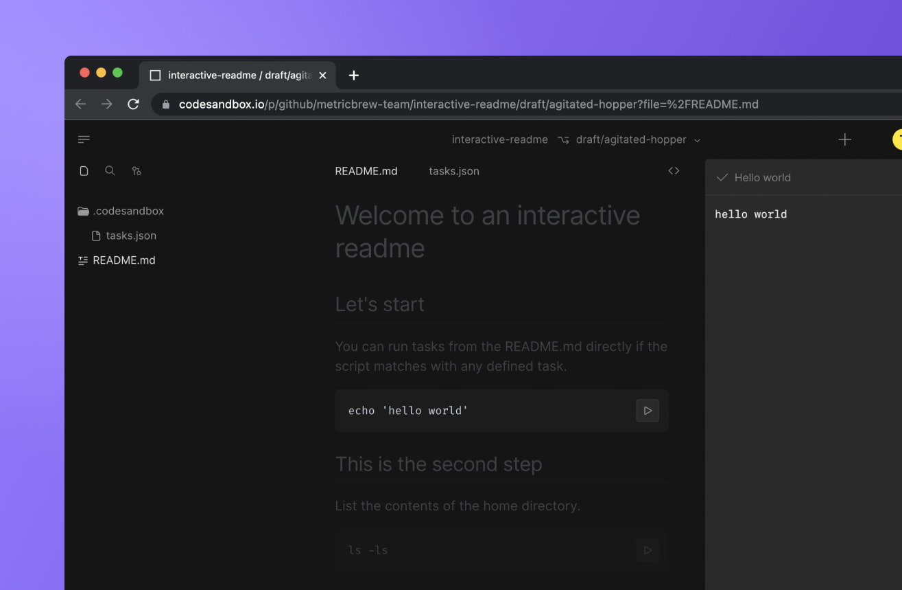

# Interactive Readme

CodeSandbox supports running [tasks](/learn/repositories/task) directly from Markdown. 

To configure the interactive Readme:
1. Define a task using the [configuration file](/learn/repositories/task). Use the same shell command used in the `tasks.json` file in the markdown code block.

2. If there is a match, CodeSandbox will render a play icon next to the command in the interactive view. 

Interactive tasks can be run by any user with read access to your project.

