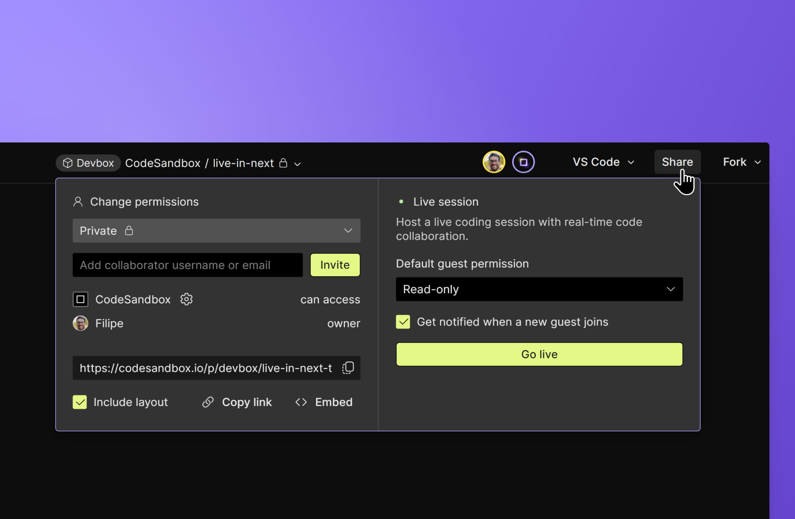

import { Callout } from 'nextra-theme-docs'

# Live Sessions

## What are live sessions?

Live sessions enable the creation of a temporary open session in a VM Sandbox, which allows you to invite any user with a CodeSandbox account to join the VM Sandbox and collaborate live. A live session can include unlimited users.

The key difference between live sessions and the default live collaboration of VM Sandboxes is that live sessions don't require invited users to be part of the workspace to which the VM Sandbox belongs.

As such, live sessions are especially useful for:
- Education: hosting a coding lesson in the classroom or online.
- Hackathons: building something live with an assorted group of collaborators. 
- Coding interviews: inviting a candidate for a live coding exercise during recruitment.

## Permissions

The VM Sandbox creator can control access to the live session in two ways.

**Granular permission levels**: the permission level of each invited user can be changed between "Read-only" or "Editor". 

**Default permission**: there's also the option to define the default permission level applied to all users who join the session. If the default level is changed mid-session, it will only apply to users who join after that last change.

## Starting a live session

Live sessions can be started from any VM Sandbox following these steps:
1. Click _Share_ on the top right of the editor.
2. (Optional) Change the desired default permission level if needed.
3. Click on _Go live_.
4. Copy and share the provided live session URL with others.
5. Run the live session and remember to click _Stop session_ when it ends.