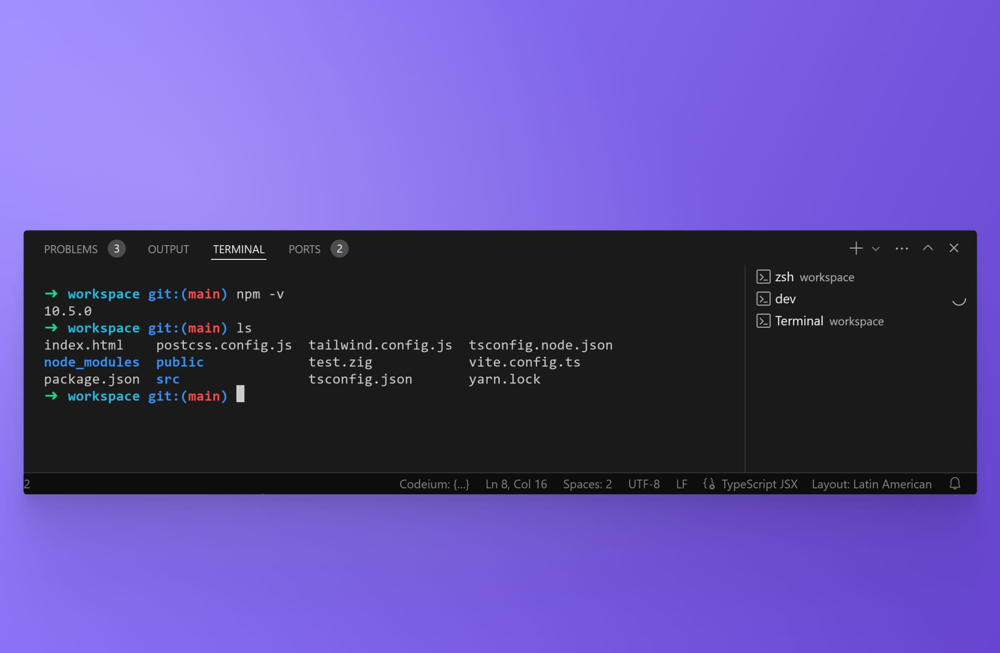
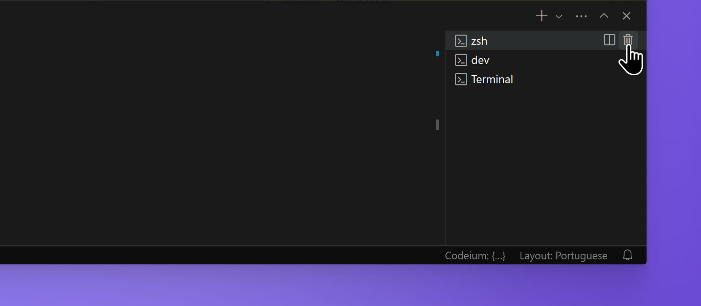

import { Callout } from 'nextra-theme-docs'

# Terminal

 
One of the benefits of working on VM Sandboxes and repositories is the ability to use terminals without ever leaving the web editor. Terminals run inside CodeSandbox VMs and behave like your local terminals, accepting any commands you are used to running, such as:
- git operations
- bash scripts
- package-management commands
- start servers

You can find all terminals listed at the right of the "Tasks and Terminals" panel, shown at the bottom of the editor. When you click a listed terminal, it will automatically open the _TERMINAL_ tab at the bottom of the editor, where you can run commands.

CodeSandbox provides three different types of terminals:

- **Native terminals**: These are the 'standard' type of terminal that you would usually find in a code editor like VS Code Desktop. These terminals are private to you, so other collaborators will not see any commands you run there. Native terminals are managed by VS Code Web.
- **Task terminals**: When you run a [Task](./task), it will run on a dedicated task terminal. Typically, you can identify these task terminals because they will be named according to the name of the corresponding task (e.g., `dev`). Task terminals are managed by Pitcher, an internal CodeSandbox service.
- **Shared terminals**: These terminals are identical in functionality to native terminals, with the main difference that they can be seen by other collaborators. They can be especially useful when someone on your team encounters errors or has a hard time fixing a problem—you can quickly jump in and instantly understand what is going on. Shared terminals can only be created and opened from the _Shared Terminals_ section of the [DevTools](./devtools) panel, which shows a list of all active shared terminals. Shared terminals are managed by Pitcher, an internal CodeSandbox service.

## Managing terminals
You can add and remove terminals using the options at the right of the "Tasks and Terminals" panel, shown at the bottom of the editor.

<Callout emoji="💡">
If you need to run commands that depend on sudo/root access, check out our [tutorial](/tutorial/getting-started-with-docker) about using Docker.
</Callout>
