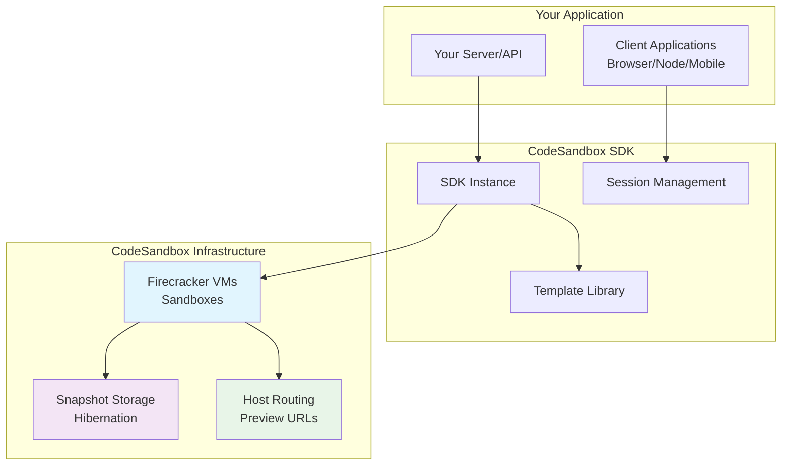
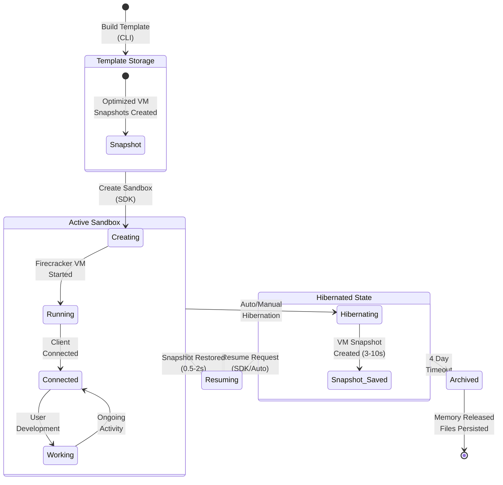
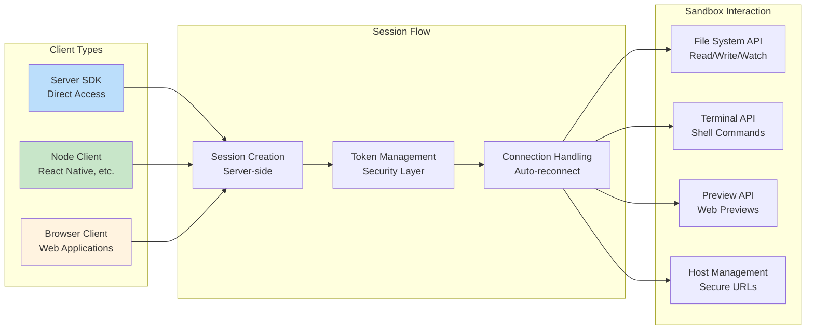
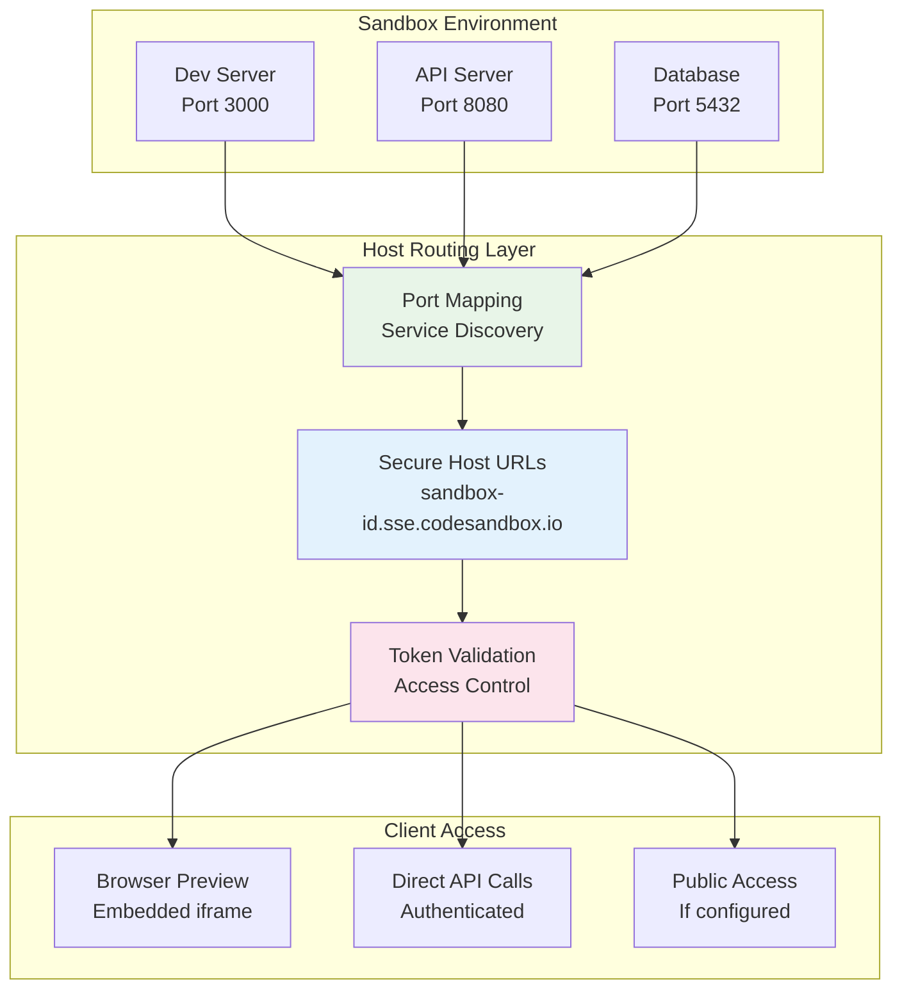
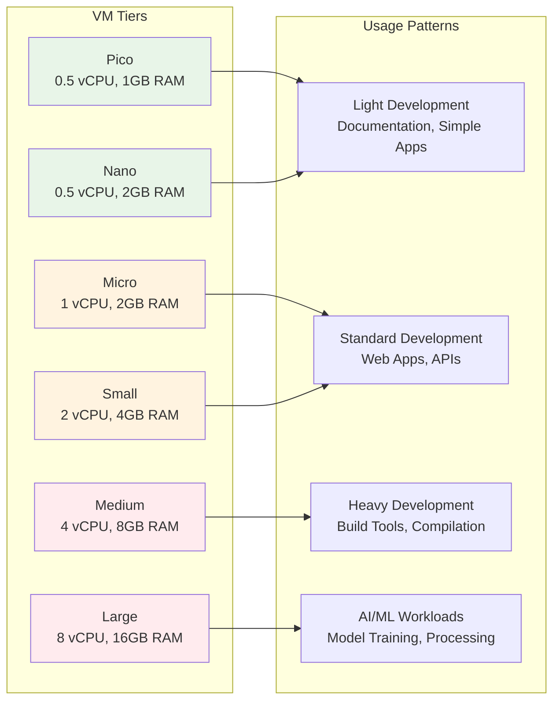

import { Callout } from 'nextra-theme-docs'

# How It Works

The CodeSandbox SDK provides a complete cloud development infrastructure that allows you to programmatically create, manage, and interact with isolated development environments. This page explains the conceptual architecture and terminology to help you understand how Sandboxes integrate with your product.

## Core Architecture

At its heart, the SDK orchestrates three main components that work together to deliver secure, scalable development environments:

## Key Concepts

### Templates
**Templates** are pre-configured environment snapshots that serve as the foundation for creating Sandboxes. Think of them as "golden images" that contain:
- Pre-installed dependencies
- Development server configurations
- Custom Docker environments
- Setup tasks and workflows

Templates ensure consistent, fast Sandbox creation and eliminate the need to install dependencies every time.

### Sandboxes
**Sandboxes** are isolated virtual machines (Firecracker VMs) running your development environments. Each Sandbox:
- Runs completely isolated from others
- Has persistent file storage with git integration
- Can be hibernated and resumed with full state preservation
- Exposes services through secure host URLs

### Sessions
**Sessions** provide secure, permission-controlled access to Sandboxes. Each session:
- Maps to a specific user with consistent identity
- Controls read/write permissions
- Manages git credentials and environment variables
- Enables secure host access through tokens

## The Sandbox Lifecycle

Understanding how Sandboxes move through their lifecycle is crucial for effective integration:

### Phase 1: Template Creation
1. **Development**: Create your project structure locally
2. **Configuration**: Add `.codesandbox/tasks.json` with setup tasks and dev server config
3. **Building**: Use CLI to deploy optimized snapshots across global clusters
4. **Storage**: Template becomes available for rapid Sandbox creation

### Phase 2: Sandbox Management
1. **Creation**: Instantiate new Sandboxes from templates (~1-3 seconds)
2. **Connection**: Establish secure sessions with appropriate permissions
3. **Development**: Users interact with the environment through clients
4. **Hibernation**: Automatically or manually pause Sandboxes to save resources
5. **Resume**: Restore exact state when needed (~0.5-2 seconds)

### Phase 3: Resource Management
1. **Monitoring**: Track active Sandboxes and resource usage
2. **Scaling**: Manage VM tiers and concurrent limits
3. **Persistence**: Files auto-persist via git, snapshots expire after 4 days
4. **Cleanup**: Archive unused Sandboxes to optimize costs

## Client Architecture

The SDK supports multiple client environments, each designed for specific use cases:

### Server SDK
Direct integration for backend applications where the SDK manages Sandbox lifecycle directly.

### Client SDKs
Browser and Node clients that connect through session tokens, enabling:
- Secure access without exposing API keys
- Automatic reconnection and state management
- Real-time interaction with Sandbox services

## Host and Preview System

When your Sandbox runs services (like development servers), they become accessible through a sophisticated routing system:

### Privacy Levels
- **Public**: Sandbox and hosts are publicly accessible
- **Private**: Requires tokens for all access
- **Public-hosts**: Sandbox is private, but services are publicly accessible

### Preview Integration
The Preview API enables embedding Sandbox services directly in your application with:
- Secure iframe embedding
- Message passing for communication
- Navigation controls and custom code injection

## Integration Patterns

### Pattern 1: User Development Environments
Perfect for educational platforms, coding interviews, or team development:

1. Create templates for different tech stacks
2. Provision Sandboxes per user/project
3. Manage sessions tied to user accounts
4. Handle hibernation based on user activity

### Pattern 2: AI Code Interpretation
Ideal for AI agents that need to execute code safely:

1. Create specialized templates for different runtimes
2. Spin up Sandboxes per agent task
3. Use filesystem API for code execution
4. Hibernate immediately after task completion

### Pattern 3: CI/CD and Testing
Scale testing across multiple environments:

1. Build template with test setup
2. Fork Sandboxes for parallel test execution  
3. Use terminal API to run test suites
4. Aggregate results and clean up resources

<Callout>
**Best Practice**: Always use templates built with the CLI rather than generic setups. Pre-configured templates with snapshots provide the fastest, most reliable Sandbox creation experience and ensure consistency across your application.
</Callout>

## Resource Management

Understanding resource management helps optimize costs and performance:

### Cost Optimization Strategies
- **Template-based creation**: Avoid dependency installation overhead
- **Active hibernation**: Don't rely on timeouts, actively hibernate when done
- **Right-sizing VMs**: Start with appropriate tiers, upgrade only when needed
- **Session management**: Track user activity to determine optimal hibernation timing

The CodeSandbox SDK abstracts away the complexity of managing cloud development infrastructure while giving you complete control over the user experience. By understanding these core concepts, you can build sophisticated applications that leverage isolated, scalable development environments.