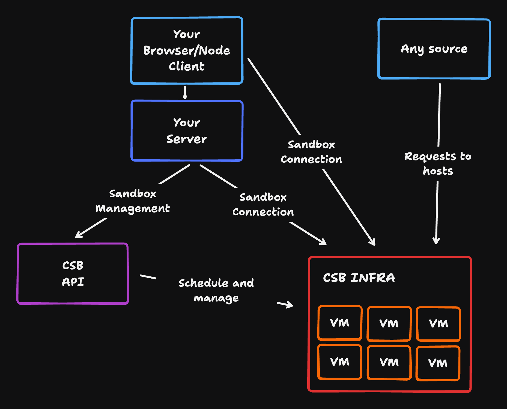
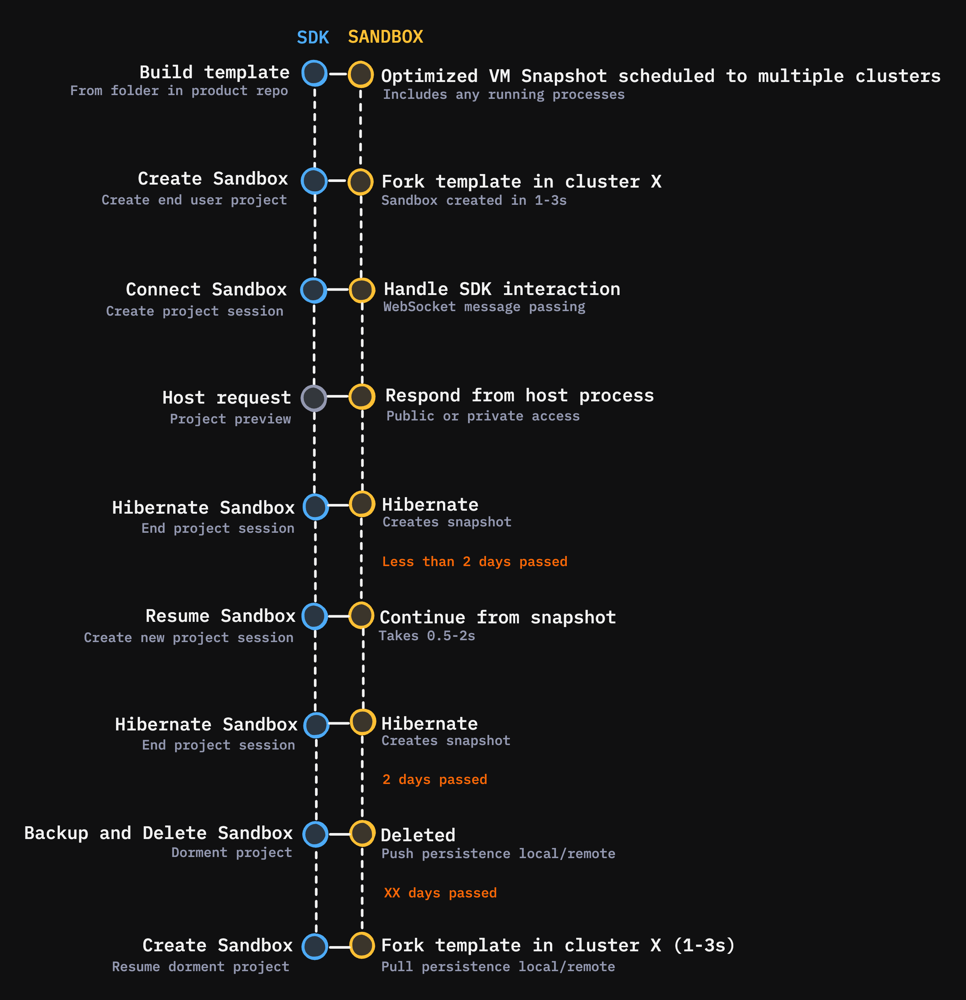

import { Callout } from 'nextra-theme-docs'

# How It Works

The CodeSandbox SDK provides a complete cloud development infrastructure that allows you to programmatically create, manage, and interact with isolated development environments. This page explains the conceptual architecture and terminology to help you understand how Sandboxes integrate with your product.

## Core Architecture

At its heart, the SDK enables management of and connections to Sandboxes. You have a lot of flexibility on how you want to deliver secure, scalable development environments:

## Key Concepts

### Templates

**Templates** are pre-configured environment snapshots that serve as the foundation for creating Sandboxes. Think of them as "golden images" that contain:

- Pre-installed dependencies
- Development server configurations
- Custom Docker environments
- Setup tasks and workflows

Templates ensure consistent, fast Sandbox creation and eliminate the need to install dependencies every time.

### Sandboxes

**Sandboxes** are isolated virtual machines (Firecracker VMs) running your development environments. Each Sandbox:

- Runs completely isolated from others
- Has persistent file storage with git integration
- Can be hibernated and resumed with full state preservation
- Exposes services through secure host URLs

### Sessions

**Sessions** provide secure, permission-controlled access to Sandboxes. Each session:

- Maps to a specific user with consistent identity
- Controls read/write permissions
- Manages git credentials and environment variables
- Enables secure host access through tokens

## The Sandbox Lifecycle

Understanding how Sandboxes move through their lifecycle is crucial for effective integration:

## Integration points

### 1. Template Creation

1. **Development**: Create your project structure locally
2. **Configuration**: Add `.codesandbox/tasks.json` with setup tasks and dev server config
3. **Building**: Use CLI to deploy optimized snapshots across global clusters

### 2. Sandbox Management

1. **Creation**: Instantiate new Sandboxes from templates (~1-3 seconds)
2. **Connection**: Establish secure sessions with appropriate permissions
3. **Development**: Users interact with the environment through clients
4. **Hibernation**: Automatically or manually pause Sandboxes to save resources
5. **Resume**: Restore exact state when needed (~0.5-2 seconds)

### 3. Resource Management

1. **Monitoring**: Track active Sandboxes and resource usage
2. **Scaling**: Manage VM tiers and concurrent limits
3. **Persistence**: Files auto-persist via git, snapshots expire after 4 days
4. **Cleanup**: Archive unused Sandboxes to optimize costs
