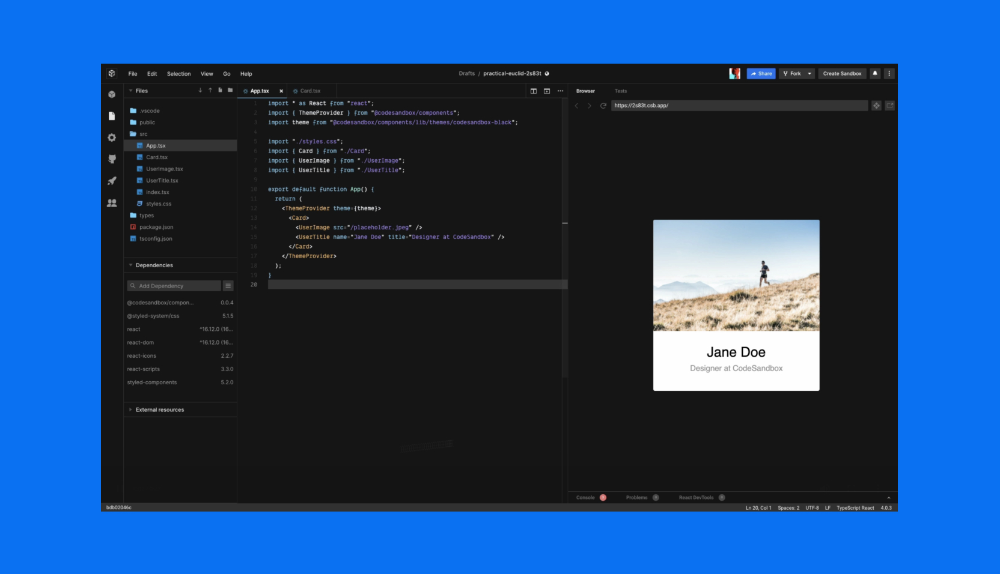

import Hero from "../../../shared-components/Hero.js"

<Hero 
  title={<>Make it fast.   Like an insight.</>}
  subtitle="CodeSandbox is an online editor for rapid web development. Prototype quickly, experiment easily, and share creations with a click."
/>

Use it to create static sites, full-stack web apps, or components on any device
with a web browser.

## Product Values

Our mission is to make web development faster. By removing complexity, we enable
web developers to be more productive. By simplifying collaboration, we make it
easier for teams to work on code together.

### Code, not infrastructure

We handle the development environment, taking on setup, tooling, and
provisioning, so it’s as fast as possible to start and build projects.

### Shareable by default

We create solutions that enable developers to work from anywhere and teams to
build together in new and more effective ways.

### Work like local

We equip developers with a local editor experience that’s familiar and
integrated with popular developer tools, so the process of creation is seamless.
