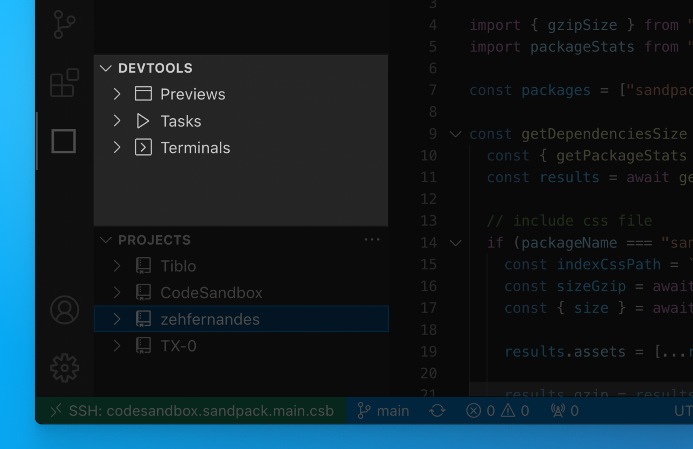

# DevTools

Just like in the CodeSandbox editor, you have access to running ports to view code changes in the browser. The available ports are listed in the panel. Clicking on a port will open a tab in your default browser

