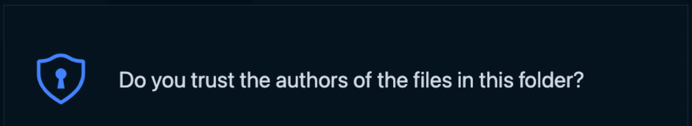

# FAQs

## What to do about that recurring trust modal?

This modal shows up every time you launch a project folder in a new container. Since every branch will be opened with a unique SSH url, VS Code will ask you to verify that you trust the connection. This is an important security notice used to confirm that the user understands the  connection being established before opening the code. You can read more about the modal [here](https://code.visualstudio.com/blogs/2021/07/06/workspace-trust).

## Do I have to be connected to live session on CodeSandbox in order to work on a branch?

It is possible to work in an “un-synced” state. In order for CodeSandbox features to work, the branch needs to established on a remote connection AND connected to Pitcher (see How it works for more information

## Who can access my code?

Only people on your CodeSandbox team with permissions to the repository may join as a collaborator. Repository permissions are carried over from Github. To add someone new to the team, provide access on Github and add them to the CodeSandbox. From there, they can access the code in the browser or follow the steps above to use VS Code.

## More Questions?

For questions and support please use the community [discord server](https://discord.gg/R32XxEGp4s).