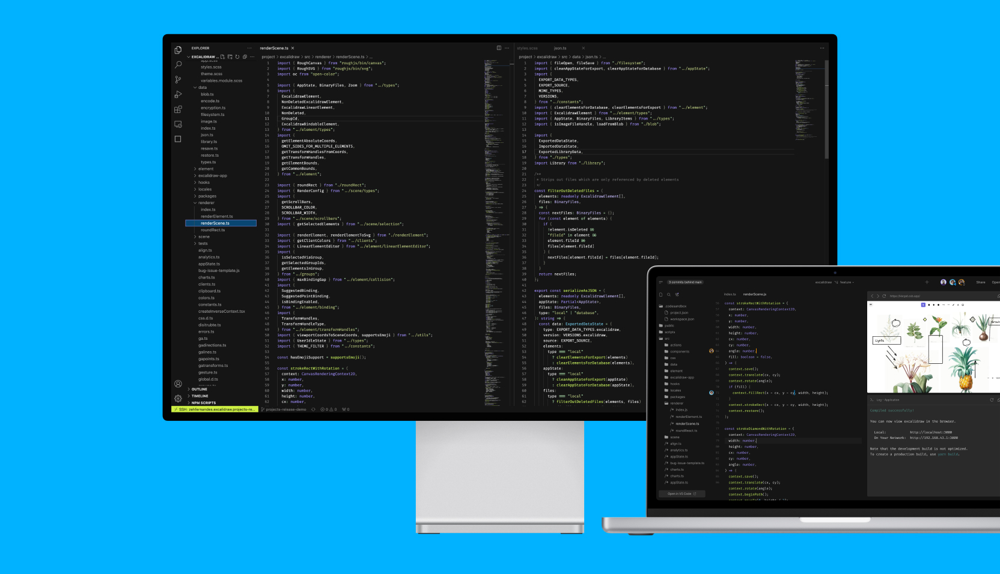

import Video from '../../../shared-components/Video'
import Hero from "../../../shared-components/Hero.js"

<Hero t
  title={<>VS Code with superpowers.</>}
  subtitle="The VS Code extension uses Remote - SSH to bring the best of CodeSandbox Projects to your local tool."
/>

## Getting Started

1. If needed, install [Visual Studio Code](https://code.visualstudio.com/) for Windows *(7+)*, macOS *(10.11 +)*, or Linux.
2. Download and install the [CodeSandbox extension](https://marketplace.visualstudio.com/items?itemName=CodeSandbox-io.codesandbox-projects) for Visual Studio Code.
3. Wait for the extension to finish downloading and then reload VS Code when prompted.
4. Click on CodeSandbox icon in the side menu and login 
5. Connect to your project

## How it works

When you connect to your CodeSandbox account and open a branch, a virtual container is spun up with [Remote - SSH](https://marketplace.visualstudio.com/items?itemName=ms-vscode-remote.remote-ssh) to allow you to access your code. At the same time, a connection is established with a CodeSandbox API called Pitcher. This is the service that powers all of the collaboration features across different editors including the web and mobile. 

It is possible to work on the ssh connection while disconnected to Pitcher, but you should be mindful that other team members may be making changes to your branch while you are in an un-synced state, so be sure to commit often.

Only people on your team in CodeSandbox have access to these repositories. 

So the VSCode Extension actually connects directly to the container with an SSH connection, completely bypassing Pitcher, where it operates directly with the FileSystem.
On top of this we also connect to Pitcher, just like we do in the browser, where we "tie it together".

